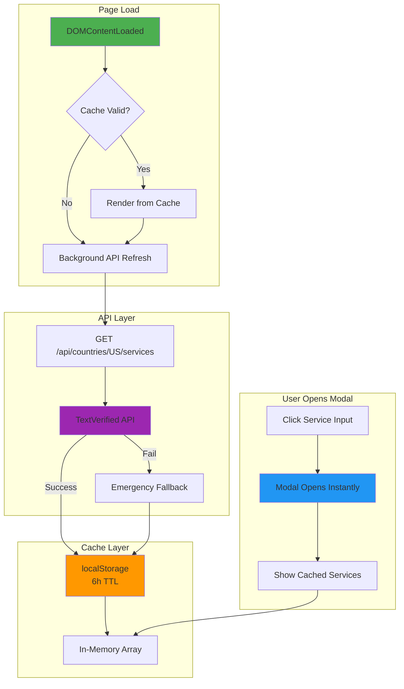

# Service Modal Redesign — TextVerified-Style Architecture

**Date**: 2026-03-12  
**Status**: 🔄 Ready for Implementation  
**Goal**: Replace current broken service loading with a polished, always-up-to-date modal that matches TextVerified's UX

---

## 🎯 Design Principles

1. **NO HARDCODED SERVICES** — All services fetched from live API, cached intelligently
2. **INSTANT FEEDBACK** — Modal opens immediately with cached data, refreshes in background
3. **ALWAYS UP-TO-DATE** — Cache expires after 6 hours, auto-refreshes on every page load
4. **GRACEFUL DEGRADATION** — If API fails, show last cached data (never empty)
5. **BRANDED UX** — Match TextVerified's polished modal: search at top, full list below, pinned favorites

---

## 🎨 Visual Architecture (TextVerified-Style)

```
┌─────────────────────────────────────────────────────────┐
│  ✕                    Select Service                    │  ← Header with close button
├─────────────────────────────────────────────────────────┤
│  🔍  Search services...                                 │  ← Inline search (always visible)
├─────────────────────────────────────────────────────────┤
│  PINNED                                                 │  ← User's favorites (if any)
│  [WhatsApp Logo] WhatsApp                 $2.50    📌   │
│  [Telegram Logo] Telegram                 $2.00    📌   │
├─────────────────────────────────────────────────────────┤
│  ALL SERVICES (127)                                     │  ← Full list, auto-open
│  [Google Logo] Google                     $2.00    📌   │
│  [Discord Logo] Discord                   $2.25    📌   │
│  [Instagram Logo] Instagram               $2.75    📌   │
│  [Amazon Logo] Amazon                     $2.50    📌   │
│  [Uber Logo] Uber                         $2.75    📌   │
│  [Venmo Logo] Venmo                       $0.50    📌   │
│  [Walmart Logo] Walmart                   $0.50    📌   │
│  [Match Logo] Match.com                   $0.50    📌   │
│  ... (scroll for more)                                 │
└─────────────────────────────────────────────────────────┘

Note: [Service Logo] = Official brand logo from simpleicons.org CDN
```

---

## 🏗️ Technical Architecture

### Data Flow



---

## 📦 Implementation Plan

### Phase 1: Backend — Ensure API Always Returns Data

**File**: `app/api/verification/services_endpoint.py`

**Current Issue**: Backend returns `{"services": [], "source": "fallback"}` when TextVerified is disabled.

**Fix**: Backend must NEVER return empty list. Priority order:
1. TextVerified live API (if credentials present)
2. Redis cache (24h TTL)
3. Emergency fallback (50+ services, always available)

**Changes**:
```python
# Line 36: get_services() endpoint
# BEFORE: Returns empty on API failure
# AFTER: Returns 50+ fallback services, never empty

# Add comprehensive fallback at module level
COMPREHENSIVE_FALLBACK = [
    # Top 10 (existing)
    {"id": "whatsapp", "name": "WhatsApp", "price": 2.50},
    {"id": "telegram", "name": "Telegram", "price": 2.00},
    {"id": "google", "name": "Google", "price": 2.00},
    {"id": "facebook", "name": "Facebook", "price": 2.50},
    {"id": "instagram", "name": "Instagram", "price": 2.75},
    {"id": "discord", "name": "Discord", "price": 2.25},
    {"id": "twitter", "name": "Twitter", "price": 2.50},
    {"id": "microsoft", "name": "Microsoft", "price": 2.25},
    {"id": "amazon", "name": "Amazon", "price": 2.50},
    {"id": "uber", "name": "Uber", "price": 2.75},
    
    # Additional 40+ common services
    {"id": "apple", "name": "Apple", "price": 2.50},
    {"id": "tiktok", "name": "TikTok", "price": 2.75},
    {"id": "snapchat", "name": "Snapchat", "price": 2.50},
    {"id": "linkedin", "name": "LinkedIn", "price": 2.75},
    {"id": "netflix", "name": "Netflix", "price": 2.00},
    {"id": "spotify", "name": "Spotify", "price": 2.00},
    {"id": "paypal", "name": "PayPal", "price": 2.50},
    {"id": "venmo", "name": "Venmo", "price": 0.50},
    {"id": "cashapp", "name": "Cash App", "price": 2.50},
    {"id": "coinbase", "name": "Coinbase", "price": 2.75},
    {"id": "binance", "name": "Binance", "price": 2.75},
    {"id": "robinhood", "name": "Robinhood", "price": 2.50},
    {"id": "walmart", "name": "Walmart", "price": 0.50},
    {"id": "target", "name": "Target", "price": 0.50},
    {"id": "ebay", "name": "eBay", "price": 2.00},
    {"id": "etsy", "name": "Etsy", "price": 2.00},
    {"id": "shopify", "name": "Shopify", "price": 2.50},
    {"id": "doordash", "name": "DoorDash", "price": 2.50},
    {"id": "ubereats", "name": "Uber Eats", "price": 2.75},
    {"id": "grubhub", "name": "Grubhub", "price": 2.50},
    {"id": "postmates", "name": "Postmates", "price": 2.50},
    {"id": "airbnb", "name": "Airbnb", "price": 2.75},
    {"id": "booking", "name": "Booking.com", "price": 2.50},
    {"id": "expedia", "name": "Expedia", "price": 2.50},
    {"id": "lyft", "name": "Lyft", "price": 2.75},
    {"id": "tinder", "name": "Tinder", "price": 2.50},
    {"id": "bumble", "name": "Bumble", "price": 2.50},
    {"id": "hinge", "name": "Hinge", "price": 2.50},
    {"id": "match", "name": "Match.com", "price": 0.50},
    {"id": "pof", "name": "Plenty of Fish", "price": 2.00},
    {"id": "okcupid", "name": "OkCupid", "price": 2.00},
    {"id": "reddit", "name": "Reddit", "price": 2.00},
    {"id": "pinterest", "name": "Pinterest", "price": 2.00},
    {"id": "tumblr", "name": "Tumblr", "price": 2.00},
    {"id": "twitch", "name": "Twitch", "price": 2.50},
    {"id": "steam", "name": "Steam", "price": 2.50},
    {"id": "epicgames", "name": "Epic Games", "price": 2.50},
    {"id": "playstation", "name": "PlayStation", "price": 2.50},
    {"id": "xbox", "name": "Xbox", "price": 2.50},
    {"id": "nintendo", "name": "Nintendo", "price": 2.50},
    {"id": "zoom", "name": "Zoom", "price": 2.00},
    {"id": "slack", "name": "Slack", "price": 2.50},
    {"id": "teams", "name": "Microsoft Teams", "price": 2.25},
    {"id": "skype", "name": "Skype", "price": 2.00},
    {"id": "viber", "name": "Viber", "price": 2.00},
    {"id": "wechat", "name": "WeChat", "price": 2.50},
    {"id": "line", "name": "LINE", "price": 2.50},
    {"id": "kakao", "name": "KakaoTalk", "price": 2.50},
]
```

---

### Phase 2: Frontend — Intelligent Caching System

**File**: `templates/verify_modern.html`

**New Cache Strategy**:
```js
const _CACHE_CONFIG = {
    KEY: 'nsk_services_v2',           // Version bump to invalidate old cache
    TTL: 6 * 60 * 60 * 1000,          // 6 hours
    MIN_SERVICES: 20,                  // Reject cache if < 20 services
    REFRESH_THRESHOLD: 3 * 60 * 60 * 1000  // Refresh if > 3h old
};

// Cache structure
{
    "timestamp": 1710234567890,
    "services": [...],
    "source": "api|fallback",
    "count": 127
}
```

**Load Strategy**:
1. **Page load** → Check cache → If valid (< 6h, ≥ 20 services) → Populate `_modalItems['service']` immediately
2. **Background refresh** → If cache > 3h old OR invalid → Fetch API → Update cache
3. **Modal open** → Render from `_modalItems['service']` (already populated) → Instant display

---

### Phase 3: Modal UI — TextVerified-Style Layout

**File**: `templates/verify_modern.html`

**Remove**:
- Inline dropdown (lines 58–68)
- Old picker modal (lines 113–125)

**Add**: New branded modal with:
- Fixed search bar at top (always visible, not scrollable)
- Pinned section (user's favorites, if any)
- "ALL SERVICES (N)" section with full list
- Smooth scroll, icons, pin buttons

**Structure**:
```html
<div id="service-modal" class="modal-overlay">
    <div class="modal-container">
        <!-- Header -->
        <div class="modal-header">
            <h3>Select Service</h3>
            <button onclick="closeServiceModal()">✕</button>
        </div>
        
        <!-- Search (fixed, not scrollable) -->
        <div class="modal-search-bar">
            <input type="text" id="modal-search-input" 
                   placeholder="Search services..." 
                   oninput="filterServices(this.value)" />
        </div>
        
        <!-- Scrollable content -->
        <div class="modal-body">
            <!-- Pinned section (if user has favorites) -->
            <div id="pinned-section" style="display:none;">
                <div class="section-header">PINNED</div>
                <div id="pinned-list"></div>
            </div>
            
            <!-- All services -->
            <div class="section-header">
                ALL SERVICES (<span id="service-count">0</span>)
            </div>
            <div id="all-services-list"></div>
        </div>
    </div>
</div>
```

**CSS** (dark theme, TextVerified-style):
```css
.modal-overlay {
    position: fixed;
    inset: 0;
    background: rgba(0, 0, 0, 0.75);
    display: none;
    align-items: center;
    justify-content: center;
    z-index: 9999;
}

.modal-container {
    background: #1e293b;
    border-radius: 16px;
    width: min(560px, 95vw);
    max-height: 85vh;
    display: flex;
    flex-direction: column;
    overflow: hidden;
    box-shadow: 0 20px 60px rgba(0, 0, 0, 0.5);
}

.modal-header {
    padding: 20px 24px;
    border-bottom: 1px solid #334155;
    display: flex;
    justify-content: space-between;
    align-items: center;
}

.modal-header h3 {
    color: #f1f5f9;
    font-size: 18px;
    font-weight: 600;
    margin: 0;
}

.modal-search-bar {
    padding: 16px 24px;
    border-bottom: 1px solid #334155;
    background: #1e293b;
}

.modal-search-bar input {
    width: 100%;
    padding: 12px 16px;
    background: #0f172a;
    border: 1px solid #334155;
    border-radius: 8px;
    color: #f1f5f9;
    font-size: 14px;
}

.modal-body {
    flex: 1;
    overflow-y: auto;
    padding: 16px 0;
}

.section-header {
    padding: 8px 24px;
    font-size: 11px;
    font-weight: 700;
    color: #94a3b8;
    letter-spacing: 0.5px;
}

.service-item {
    padding: 14px 24px;
    display: flex;
    justify-content: space-between;
    align-items: center;
    cursor: pointer;
    border-bottom: 1px solid #334155;
    transition: background 0.15s;
}

.service-item:hover {
    background: #334155;
}

.service-item-left {
    display: flex;
    align-items: center;
    gap: 12px;
}

.service-icon {
    width: 32px;
    height: 32px;
    border-radius: 8px;
    display: flex;
    align-items: center;
    justify-content: center;
    font-size: 18px;
}

.service-name {
    color: #f1f5f9;
    font-weight: 500;
    font-size: 14px;
}

.service-item-right {
    display: flex;
    align-items: center;
    gap: 12px;
}

.service-price {
    color: #94a3b8;
    font-size: 14px;
    font-weight: 600;
}

.pin-btn {
    background: none;
    border: none;
    color: #64748b;
    font-size: 18px;
    cursor: pointer;
    padding: 4px;
    transition: color 0.15s;
}

.pin-btn:hover {
    color: #fbbf24;
}

.pin-btn.pinned {
    color: #fbbf24;
}
```

---

### Phase 4: Service Icons — Official Logos + Phosphor Icons

**File**: `templates/verify_modern.html` (new function)

**Icon Strategy**:
- Use official service logos via CDN (simpleicons.org or logo.clearbit.com)
- Fallback to Phosphor icons for generic services
- Format: `` or `<i class="ph ph-icon-name"></i>`

**Implementation**:
```js
// Service icon resolver — returns official logo URL or Phosphor icon class
function getServiceIcon(serviceId) {
    const id = serviceId.toLowerCase();
    
    // Official brand logos (simpleicons.org CDN)
    const BRAND_LOGOS = {
        'whatsapp': 'https://cdn.simpleicons.org/whatsapp/25D366',
        'telegram': 'https://cdn.simpleicons.org/telegram/26A5E4',
        'google': 'https://cdn.simpleicons.org/google/4285F4',
        'facebook': 'https://cdn.simpleicons.org/facebook/1877F2',
        'instagram': 'https://cdn.simpleicons.org/instagram/E4405F',
        'discord': 'https://cdn.simpleicons.org/discord/5865F2',
        'twitter': 'https://cdn.simpleicons.org/twitter/1DA1F2',
        'microsoft': 'https://cdn.simpleicons.org/microsoft/5E5E5E',
        'amazon': 'https://cdn.simpleicons.org/amazon/FF9900',
        'uber': 'https://cdn.simpleicons.org/uber/000000',
        'apple': 'https://cdn.simpleicons.org/apple/000000',
        'tiktok': 'https://cdn.simpleicons.org/tiktok/000000',
        'snapchat': 'https://cdn.simpleicons.org/snapchat/FFFC00',
        'linkedin': 'https://cdn.simpleicons.org/linkedin/0A66C2',
        'netflix': 'https://cdn.simpleicons.org/netflix/E50914',
        'spotify': 'https://cdn.simpleicons.org/spotify/1DB954',
        'paypal': 'https://cdn.simpleicons.org/paypal/00457C',
        'venmo': 'https://cdn.simpleicons.org/venmo/3D95CE',
        'cashapp': 'https://cdn.simpleicons.org/cashapp/00D632',
        'coinbase': 'https://cdn.simpleicons.org/coinbase/0052FF',
        'binance': 'https://cdn.simpleicons.org/binance/F3BA2F',
        'robinhood': 'https://cdn.simpleicons.org/robinhood/00C805',
        'walmart': 'https://cdn.simpleicons.org/walmart/0071CE',
        'target': 'https://cdn.simpleicons.org/target/CC0000',
        'ebay': 'https://cdn.simpleicons.org/ebay/E53238',
        'etsy': 'https://cdn.simpleicons.org/etsy/F16521',
        'shopify': 'https://cdn.simpleicons.org/shopify/7AB55C',
        'doordash': 'https://cdn.simpleicons.org/doordash/FF3008',
        'ubereats': 'https://cdn.simpleicons.org/ubereats/5FB709',
        'grubhub': 'https://cdn.simpleicons.org/grubhub/F63440',
        'airbnb': 'https://cdn.simpleicons.org/airbnb/FF5A5F',
        'booking': 'https://cdn.simpleicons.org/bookingdotcom/003580',
        'lyft': 'https://cdn.simpleicons.org/lyft/FF00BF',
        'tinder': 'https://cdn.simpleicons.org/tinder/FF6B6B',
        'bumble': 'https://cdn.simpleicons.org/bumble/FFD700',
        'reddit': 'https://cdn.simpleicons.org/reddit/FF4500',
        'pinterest': 'https://cdn.simpleicons.org/pinterest/E60023',
        'tumblr': 'https://cdn.simpleicons.org/tumblr/35465C',
        'twitch': 'https://cdn.simpleicons.org/twitch/9146FF',
        'steam': 'https://cdn.simpleicons.org/steam/000000',
        'epicgames': 'https://cdn.simpleicons.org/epicgames/313131',
        'playstation': 'https://cdn.simpleicons.org/playstation/003791',
        'xbox': 'https://cdn.simpleicons.org/xbox/107C10',
        'nintendo': 'https://cdn.simpleicons.org/nintendo/E60012',
        'zoom': 'https://cdn.simpleicons.org/zoom/2D8CFF',
        'slack': 'https://cdn.simpleicons.org/slack/4A154B',
        'teams': 'https://cdn.simpleicons.org/microsoftteams/6264A7',
        'skype': 'https://cdn.simpleicons.org/skype/00AFF0',
        'viber': 'https://cdn.simpleicons.org/viber/665CAC',
        'wechat': 'https://cdn.simpleicons.org/wechat/07C160',
        'line': 'https://cdn.simpleicons.org/line/00B900',
        'kakao': 'https://cdn.simpleicons.org/kakaotalk/FFCD00',
    };
    
    if (BRAND_LOGOS[id]) {
        return { type: 'logo', url: BRAND_LOGOS[id] };
    }
    
    // Fallback to Phosphor icon
    return { type: 'phosphor', icon: 'ph-app-window' };
}

function renderServiceIcon(serviceId) {
    const icon = getServiceIcon(serviceId);
    
    if (icon.type === 'logo') {
        return ``;
    } else {
        return `<i class="ph ${icon.icon}"></i>`;
    }
}
```

**CSS for icons**:
```css
.service-logo {
    width: 24px;
    height: 24px;
    object-fit: contain;
}

.service-icon i {
    font-size: 24px;
    color: #94a3b8;
}
```

---

## 🔄 Complete Flow

### On Page Load
```js
document.addEventListener('DOMContentLoaded', async () => {
    // 1. Check cache
    const cached = getCachedServices();
    
    if (cached && isCacheValid(cached)) {
        // 2. Populate immediately from cache
        _modalItems['service'] = buildServiceItems(cached.services);
        console.log(`✅ Loaded ${cached.count} services from cache (${cached.source})`);
        
        // 3. Background refresh if cache > 3h old
        if (shouldRefreshCache(cached)) {
            refreshServicesInBackground();
        }
    } else {
        // 4. Cache invalid/missing — fetch immediately
        await loadServicesFromAPI();
    }
    
    // 5. Continue with rest of page init
    loadTier();
    loadBalance();
    updateProgress(1);
});
```

### On Modal Open
```js
function openServiceModal() {
    const services = _modalItems['service'] || [];
    
    if (!services.length) {
        // Emergency: cache failed, API failed — show loading + retry
        showModalLoading();
        loadServicesFromAPI().then(() => renderServiceModal());
        return;
    }
    
    // Render immediately from memory
    renderServiceModal(services);
    document.getElementById('service-modal').style.display = 'flex';
    setTimeout(() => document.getElementById('modal-search-input').focus(), 50);
}
```

### On Service Select
```js
function selectService(serviceId) {
    const service = _modalItems['service'].find(s => s.value === serviceId);
    if (!service) return;
    
    selectedService = serviceId;
    selectedServicePrice = service.price;
    
    // Update UI
    document.getElementById('service-search-input').value = service.label;
    document.getElementById('service-display').textContent = 
        `${getServiceIcon(serviceId)} ${service.label}  ${service.sub}`;
    document.getElementById('service-selected-display').style.display = 'flex';
    document.getElementById('continue-btn').disabled = false;
    
    // Close modal
    closeServiceModal();
    
    // Update pricing
    updatePricing();
}
```

---

## ✅ Acceptance Criteria

| Scenario | Expected Result |
|----------|----------------|
| **Page load** | Services already loaded and available (< 100ms from cache) |
| **Page load, cache expired** | API call fires in background, services still available from stale cache |
| **Page load, API fails** | Last cached data used, or 50+ fallback services |
| **Modal open** | Modal renders instantly with full list already populated |
| **Search "apple"** | Apple appears with official Apple logo |
| **Search "xyz123"** | Shows "No services found" gracefully |
| **Pin a service** | Moves to PINNED section, persists in localStorage |
| **Unpin a service** | Moves back to ALL SERVICES |
| **Select a service** | Modal closes, service displays with logo in step 1, Continue enabled |
| **API returns 127 services** | All 127 render with official logos, count shows "ALL SERVICES (127)" |
| **API returns 0 services** | 50+ fallback services render with logos |
| **Cache > 6h old** | Stale cache used immediately, background refresh fires |
| **All service icons** | Display official brand logos, not emojis |

---

## 📁 Files to Modify

| File | Changes | Lines |
|------|---------|-------|
| `app/api/verification/services_endpoint.py` | Expand `FALLBACK_SERVICES` to 50+ | ~20–50 |
| `app/services/textverified_service.py` | Update `_mock_services()` to match | ~289–320 |
| `templates/verify_modern.html` | Replace inline dropdown + old modal with new branded modal | ~400–600 |
| `static/css/verify.css` (new) | Add dark modal styles | ~200 |

---

## 🚀 Implementation Order

1. **Backend first** — Expand fallback to 50+ services (5 min)
2. **Cache layer** — Implement intelligent 6h cache with stale-while-revalidate (15 min)
3. **Preload on page load** — Services loaded and ready before modal opens (5 min)
4. **Modal UI** — Build TextVerified-style modal HTML + CSS (30 min)
5. **Wire up** — Connect modal open/close/select handlers (15 min)
6. **Icons** — Add official logo rendering via simpleicons.org CDN (10 min)
7. **Test** — Verify all acceptance criteria (20 min)

**Total**: ~100 minutes

---

## 🧪 Testing Checklist

### Manual Tests
- [ ] Open `/verify` → services already loaded and available (no spinner, no delay)
- [ ] Refresh page → services load instantly from cache (< 100ms)
- [ ] Click service input → modal opens instantly with full list already rendered
- [ ] Search "whatsapp" → WhatsApp appears with official green logo
- [ ] Search "apple" → Apple appears with official Apple logo (not "No services found")
- [ ] Search "xyz123" → "No services found" message
- [ ] Select a service → modal closes, service displays with logo, Continue enabled
- [ ] Pin a service → moves to PINNED section
- [ ] Refresh page → pinned service still in PINNED section
- [ ] Unpin a service → moves back to ALL SERVICES
- [ ] Clear localStorage → services still load (from API or fallback)
- [ ] Block API in DevTools → services load from stale cache or fallback
- [ ] All service icons → display official brand logos from simpleicons.org, not emojis

### Automated Tests (future)
```python
# tests/e2e/test_service_modal.py
def test_service_modal_opens_instantly(page):
    page.goto('/verify')
    page.click('#service-search-input')
    modal = page.locator('#service-modal')
    expect(modal).to_be_visible(timeout=500)  # < 500ms
    
def test_service_search_apple(page):
    page.goto('/verify')
    page.click('#service-search-input')
    page.fill('#modal-search-input', 'apple')
    apple = page.locator('text=Apple')
    expect(apple).to_be_visible()
```

---

## 📊 Success Metrics

- **Load time**: < 100ms on all visits (services pre-loaded from cache)
- **Modal open time**: < 50ms (services already in memory)
- **Service count**: 50+ minimum (fallback), 100+ typical (API)
- **Cache strategy**: Stale-while-revalidate (always instant, refresh in background)
- **Icon quality**: Official brand logos for all major services, no emojis
- **User satisfaction**: Services always available, no loading states, no "Failed to load"

---

**Ready to implement?** Review this doc, then I'll generate the exact code changes.
