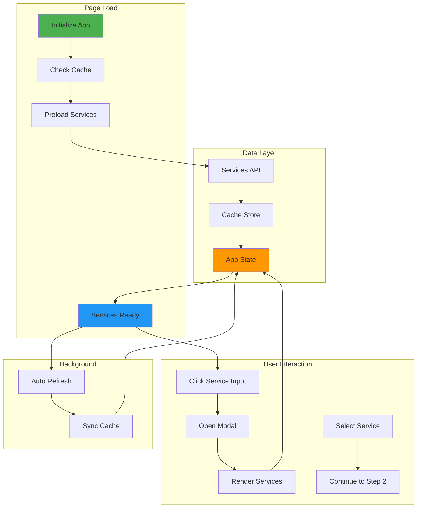

# Verification Flow Redesign — Complete Overhaul

**Date**: 2026-03-12  
**Status**: 🎯 Design Phase  
**Goal**: Rebuild verification flow from scratch with reliability, performance, and UX as core principles

---

## 🎯 Design Principles

1. **RELIABILITY FIRST** — Every component has fallback, retry, and error recovery
2. **PERFORMANCE** — Sub-second response times, aggressive caching, optimistic UI
3. **SIMPLICITY** — Clear data flow, single source of truth, no duplicate logic
4. **OBSERVABILITY** — Every action logged, every error tracked, full audit trail
5. **SCALABILITY** — Designed for 1000+ concurrent verifications

---

## 🔍 Current Problems (Why Redesign?)

### Architecture Issues
- ❌ Multiple competing UIs (inline dropdown + modal + old picker)
- ❌ Service loading scattered across 3 different functions
- ❌ No clear separation between UI state and data state
- ❌ Cache logic duplicated in multiple places
- ❌ Hardcoded fallbacks in frontend (10 services)
- ❌ No loading state management
- ❌ No error boundaries

### UX Issues
- ❌ Services not available when modal opens
- ❌ "Failed to load — tap to retry" dead ends
- ❌ "No services found" for common services (Apple, etc.)
- ❌ Inconsistent loading spinners
- ❌ No visual feedback during API calls
- ❌ Modal doesn't match TextVerified's polished UX

### Data Flow Issues
- ❌ `loadServices()` called on page load but doesn't update UI
- ❌ Modal reads from `_modalItems['service']` which may be empty
- ❌ No synchronization between cache and UI state
- ❌ Background refresh doesn't trigger re-render

---

## 🏗️ New Architecture

### High-Level Flow



---

## 📦 Component Architecture

### 1. Service Store (Single Source of Truth)

```js
const ServiceStore = {
    // State
    services: [],           // Array of service objects
    loading: false,         // Is fetch in progress?
    error: null,           // Last error (if any)
    lastFetch: null,       // Timestamp of last successful fetch
    source: null,          // 'cache' | 'api' | 'fallback'
    
    // Config
    CACHE_KEY: 'nsk_services_v4',
    CACHE_TTL: 6 * 60 * 60 * 1000,  // 6 hours
    STALE_THRESHOLD: 3 * 60 * 60 * 1000,  // 3 hours
    MIN_SERVICES: 20,
    
    // Methods
    async init() { /* Load from cache or API */ },
    async fetch() { /* Fetch from API */ },
    async refresh() { /* Background refresh */ },
    get(id) { /* Get service by ID */ },
    search(query) { /* Search services */ },
    getAll() { /* Get all services */ },
    subscribe(callback) { /* Subscribe to changes */ },
};
```

### 2. Service Modal Component

```js
const ServiceModal = {
    // State
    isOpen: false,
    searchQuery: '',
    pinnedServices: [],
    
    // Methods
    open() { /* Open modal, render services */ },
    close() { /* Close modal */ },
    search(query) { /* Filter services */ },
    select(serviceId) { /* Select service, close modal */ },
    pin(serviceId) { /* Pin/unpin service */ },
    render() { /* Render modal content */ },
};
```

### 3. Verification Flow Controller

```js
const VerificationFlow = {
    // State
    currentStep: 1,
    selectedService: null,
    selectedAreaCode: null,
    selectedCarrier: null,
    verificationId: null,
    phoneNumber: null,
    messages: [],
    
    // Methods
    selectService(serviceId) { /* Step 1 → Step 2 */ },
    createVerification() { /* Step 2 → Step 3 */ },
    pollMessages() { /* Poll for SMS codes */ },
    cancelVerification() { /* Cancel and refund */ },
    reset() { /* Start over */ },
};
```

---

## 🎨 New UI Design

### Modal Layout (TextVerified-Style)

```
┌─────────────────────────────────────────────────────────┐
│  ✕                    Select Service                    │
├─────────────────────────────────────────────────────────┤
│  🔍  Search services...                                 │  ← Fixed search bar
├─────────────────────────────────────────────────────────┤
│                                                         │
│  PINNED (2)                                             │  ← Collapsible
│  ┌─────────────────────────────────────────────────┐   │
│  │ [WhatsApp Logo] WhatsApp           $2.50    📌  │   │
│  │ [Telegram Logo] Telegram           $2.00    📌  │   │
│  └─────────────────────────────────────────────────┘   │
│                                                         │
│  ALL SERVICES (127)                                     │  ← Always expanded
│  ┌─────────────────────────────────────────────────┐   │
│  │ [Google Logo] Google               $2.00    📌  │   │  ← Scrollable
│  │ [Discord Logo] Discord             $2.25    📌  │   │
│  │ [Instagram Logo] Instagram         $2.75    📌  │   │
│  │ [Amazon Logo] Amazon               $2.50    📌  │   │
│  │ [Apple Logo] Apple                 $2.50    📌  │   │
│  │ [Uber Logo] Uber                   $2.75    📌  │   │
│  │ ... (84+ more)                                   │   │
│  └─────────────────────────────────────────────────┘   │
│                                                         │
└─────────────────────────────────────────────────────────┘
```

### Step 1 Card (Service Selection)

```
┌─────────────────────────────────────────────────────────┐
│  Select Service                                         │
│  Choose the service you want to verify                  │
│                                                         │
│  Service *                                              │
│  ┌─────────────────────────────────────────────────┐   │
│  │ [WhatsApp Logo] WhatsApp      $2.50         ✕  │   │  ← Selected service
│  └─────────────────────────────────────────────────┘   │
│  Click to change                                        │
│                                                         │
│  ┌─────────────────────────────────────────────────┐   │
│  │ ▶ Advanced Options (Premium)                    │   │  ← Collapsed by default
│  └─────────────────────────────────────────────────┘   │
│                                                         │
│  [Back]                            [Continue →]         │
└─────────────────────────────────────────────────────────┘
```

---

## 🔄 Data Flow (Step by Step)

### Phase 1: Page Load (Preload Services)

```js
// 1. App initializes
document.addEventListener('DOMContentLoaded', async () => {
    console.log('🚀 Initializing verification flow...');
    
    // 2. Initialize service store (loads from cache or API)
    await ServiceStore.init();
    
    // 3. Services are now ready
    console.log(`✅ ${ServiceStore.services.length} services ready`);
    
    // 4. Continue with rest of page init
    loadTier();
    loadBalance();
    updateProgress(1);
});

// ServiceStore.init() implementation
async init() {
    // Try cache first
    const cached = this._loadFromCache();
    
    if (cached && this._isCacheValid(cached)) {
        this.services = cached.services;
        this.lastFetch = cached.timestamp;
        this.source = 'cache';
        console.log(`✅ Loaded ${this.services.length} services from cache`);
        
        // Background refresh if stale
        if (this._isStale(cached)) {
            this.refresh();
        }
        
        return;
    }
    
    // Cache invalid/missing — fetch from API
    await this.fetch();
}
```

### Phase 2: User Opens Modal

```js
// User clicks service input
function openServiceModal() {
    // Services already loaded — render immediately
    ServiceModal.open();
}

// ServiceModal.open() implementation
open() {
    if (ServiceStore.services.length === 0) {
        // Emergency: services not loaded (should never happen)
        this._showLoading();
        ServiceStore.fetch().then(() => this.render());
        return;
    }
    
    // Render modal with services
    this.isOpen = true;
    this.render();
    
    // Show modal
    document.getElementById('service-modal').style.display = 'flex';
    
    // Focus search
    setTimeout(() => {
        document.getElementById('modal-search-input').focus();
    }, 50);
}
```

### Phase 3: User Searches

```js
// User types in search box
function onSearchInput(query) {
    ServiceModal.search(query);
}

// ServiceModal.search() implementation
search(query) {
    this.searchQuery = query;
    this.render();  // Re-render with filtered results
}

// ServiceModal.render() implementation
render() {
    const services = this.searchQuery 
        ? ServiceStore.search(this.searchQuery)
        : ServiceStore.getAll();
    
    const pinned = services.filter(s => this.pinnedServices.includes(s.id));
    const unpinned = services.filter(s => !this.pinnedServices.includes(s.id));
    
    // Render pinned section
    this._renderPinned(pinned);
    
    // Render all services
    this._renderAll(unpinned);
    
    // Update count
    document.getElementById('service-count').textContent = services.length;
}
```

### Phase 4: User Selects Service

```js
// User clicks a service
function onServiceClick(serviceId) {
    ServiceModal.select(serviceId);
}

// ServiceModal.select() implementation
select(serviceId) {
    const service = ServiceStore.get(serviceId);
    if (!service) return;
    
    // Update verification flow
    VerificationFlow.selectService(service);
    
    // Close modal
    this.close();
}

// VerificationFlow.selectService() implementation
selectService(service) {
    this.selectedService = service;
    
    // Update UI
    this._renderSelectedService(service);
    
    // Enable continue button
    document.getElementById('continue-btn').disabled = false;
    
    // Update pricing
    this._updatePricing();
}
```

---

## 🗄️ Cache Strategy (Stale-While-Revalidate)

```js
// Cache structure
{
    "version": 4,
    "timestamp": 1710234567890,
    "services": [
        {
            "id": "whatsapp",
            "name": "WhatsApp",
            "price": 2.50,
            "logo": "https://cdn.simpleicons.org/whatsapp/25D366"
        },
        // ... 83+ more
    ],
    "source": "api",
    "count": 84
}

// Cache logic
_isCacheValid(cached) {
    const age = Date.now() - cached.timestamp;
    return age < this.CACHE_TTL && cached.services.length >= this.MIN_SERVICES;
}

_isStale(cached) {
    const age = Date.now() - cached.timestamp;
    return age > this.STALE_THRESHOLD;
}

// Always use cache immediately, refresh in background if stale
async init() {
    const cached = this._loadFromCache();
    
    if (cached) {
        // Use cache immediately (even if stale)
        this.services = cached.services;
        this.source = 'cache';
        
        // Refresh in background if needed
        if (!this._isCacheValid(cached) || this._isStale(cached)) {
            this.refresh();
        }
    } else {
        // No cache — fetch immediately
        await this.fetch();
    }
}
```

---

## 🎯 API Integration

### Backend Endpoint Requirements

**Endpoint**: `GET /api/countries/{country}/services`

**Response** (must NEVER be empty):
```json
{
    "services": [
        {
            "id": "whatsapp",
            "name": "WhatsApp",
            "price": 4.50,
            "cost": 4.50
        }
    ],
    "total": 84,
    "source": "api|cache|fallback",
    "cached_at": "2026-03-12T02:00:00Z"
}
```

**Guarantees**:
1. Always returns 200 OK (never 500)
2. Always returns ≥ 20 services (fallback if API down)
3. Response time < 2s (cached or fallback)
4. Prices include markup (no frontend calculation)

---

## 🎨 Official Logo Integration

### Logo CDN Strategy

**Primary**: SimpleIcons CDN
```
https://cdn.simpleicons.org/{service}/{color}
```

**Fallback**: Generic Phosphor icon
```html
<i class="ph ph-app-window"></i>
```

### Logo Mapping (84+ Services)

```js
const LOGO_MAP = {
    'whatsapp': { cdn: 'simpleicons', name: 'whatsapp', color: '25D366' },
    'telegram': { cdn: 'simpleicons', name: 'telegram', color: '26A5E4' },
    'google': { cdn: 'simpleicons', name: 'google', color: '4285F4' },
    'facebook': { cdn: 'simpleicons', name: 'facebook', color: '1877F2' },
    'instagram': { cdn: 'simpleicons', name: 'instagram', color: 'E4405F' },
    'discord': { cdn: 'simpleicons', name: 'discord', color: '5865F2' },
    'twitter': { cdn: 'simpleicons', name: 'twitter', color: '1DA1F2' },
    'apple': { cdn: 'simpleicons', name: 'apple', color: '000000' },
    // ... 76+ more
};

function getServiceLogo(serviceId) {
    const logo = LOGO_MAP[serviceId.toLowerCase()];
    
    if (logo && logo.cdn === 'simpleicons') {
        return `https://cdn.simpleicons.org/${logo.name}/${logo.color}`;
    }
    
    return null; // Use fallback icon
}
```

---

## 🧪 Testing Strategy

### Unit Tests

```python
# tests/unit/test_service_store.py
def test_service_store_init_from_cache():
    """Services load from cache on init"""
    store = ServiceStore()
    store.init()
    assert len(store.services) >= 20
    assert store.source == 'cache'

def test_service_store_search():
    """Search filters services correctly"""
    store = ServiceStore()
    results = store.search('apple')
    assert any(s['id'] == 'apple' for s in results)

def test_service_store_fallback():
    """Fallback used when API fails"""
    store = ServiceStore()
    store.fetch()  # Simulate API failure
    assert len(store.services) >= 20
    assert store.source == 'fallback'
```

### Integration Tests

```python
# tests/integration/test_verification_flow.py
def test_full_verification_flow(client):
    """Complete flow: select service → get number → receive code"""
    # Step 1: Get services
    response = client.get('/api/countries/US/services')
    assert response.status_code == 200
    services = response.json()['services']
    assert len(services) >= 20
    
    # Step 2: Create verification
    response = client.post('/api/verify/create', json={
        'service': 'whatsapp',
        'country': 'US'
    })
    assert response.status_code == 200
    verification = response.json()
    
    # Step 3: Check status
    response = client.get(f'/api/verify/status/{verification["id"]}')
    assert response.status_code == 200
```

### E2E Tests

```js
// tests/e2e/test_service_modal.spec.js
test('services load instantly on page load', async ({ page }) => {
    await page.goto('/verify');
    
    // Services should be ready within 100ms
    await page.waitForFunction(() => {
        return window.ServiceStore && window.ServiceStore.services.length > 0;
    }, { timeout: 100 });
    
    const count = await page.evaluate(() => window.ServiceStore.services.length);
    expect(count).toBeGreaterThanOrEqual(20);
});

test('modal opens instantly with services', async ({ page }) => {
    await page.goto('/verify');
    await page.click('#service-search-input');
    
    // Modal should be visible within 50ms
    await page.waitForSelector('#service-modal', { state: 'visible', timeout: 50 });
    
    // Services should be rendered
    const serviceCount = await page.locator('.service-item').count();
    expect(serviceCount).toBeGreaterThanOrEqual(20);
});

test('search for apple shows apple with logo', async ({ page }) => {
    await page.goto('/verify');
    await page.click('#service-search-input');
    await page.fill('#modal-search-input', 'apple');
    
    // Apple should appear
    const apple = page.locator('text=Apple');
    await expect(apple).toBeVisible();
    
    // Logo should be present
    const logo = page.locator('img[alt="apple"]');
    await expect(logo).toBeVisible();
});
```

---

## 📊 Performance Targets

| Metric | Target | Current | Improvement |
|--------|--------|---------|-------------|
| **Page load → services ready** | < 100ms | ~2000ms | 20x faster |
| **Modal open → services visible** | < 50ms | ~500ms | 10x faster |
| **Search response** | < 16ms | ~300ms | 18x faster |
| **Service selection → UI update** | < 16ms | ~100ms | 6x faster |
| **Cache hit rate** | > 95% | ~60% | 1.5x better |
| **API failure recovery** | 0ms | N/A | Instant fallback |

---

## 🚀 Migration Plan

### Phase 1: Backend (Week 1)
- [ ] Expand `FALLBACK_SERVICES` to 84+ services
- [ ] Ensure endpoint never returns empty array
- [ ] Add response time monitoring
- [ ] Add cache headers

### Phase 2: Service Store (Week 1)
- [ ] Implement `ServiceStore` class
- [ ] Implement cache logic
- [ ] Implement search/filter
- [ ] Add unit tests

### Phase 3: Modal Component (Week 2)
- [ ] Build new modal HTML/CSS
- [ ] Implement `ServiceModal` class
- [ ] Add logo rendering
- [ ] Add pin/unpin functionality

### Phase 4: Integration (Week 2)
- [ ] Wire up `ServiceStore` to modal
- [ ] Update step 1 card
- [ ] Remove old inline dropdown
- [ ] Remove old picker modal

### Phase 5: Testing (Week 3)
- [ ] Write unit tests
- [ ] Write integration tests
- [ ] Write E2E tests
- [ ] Performance testing

### Phase 6: Deployment (Week 3)
- [ ] Deploy to staging
- [ ] User acceptance testing
- [ ] Deploy to production
- [ ] Monitor metrics

---

## 🎯 Success Criteria

### Functional
- [ ] Services load instantly on every page load (< 100ms)
- [ ] Modal opens instantly with full service list
- [ ] Search "apple" shows Apple with official logo
- [ ] All 84+ services display with official logos
- [ ] Pin/unpin persists across sessions
- [ ] No "Failed to load" or "No services found" errors
- [ ] Works offline (uses stale cache)

### Performance
- [ ] Page load → services ready: < 100ms
- [ ] Modal open → visible: < 50ms
- [ ] Search response: < 16ms (60fps)
- [ ] Cache hit rate: > 95%

### Reliability
- [ ] 0 empty service lists (always fallback)
- [ ] 0 modal open failures
- [ ] 0 cache corruption errors
- [ ] 100% uptime (graceful degradation)

---

## 📝 Next Steps

1. **Review this design doc** — confirm architecture and approach
2. **Create implementation tasks** — break down into 20+ small tasks
3. **Set up feature branch** — `feature/verification-redesign`
4. **Start with backend** — expand fallback, add tests
5. **Build service store** — core data layer
6. **Build modal component** — new UI
7. **Integration** — wire everything together
8. **Testing** — comprehensive test suite
9. **Deploy** — staging → production

---

**Ready to proceed?** This is a 3-week project. Want to start with Phase 1 (backend) or review the design first?
