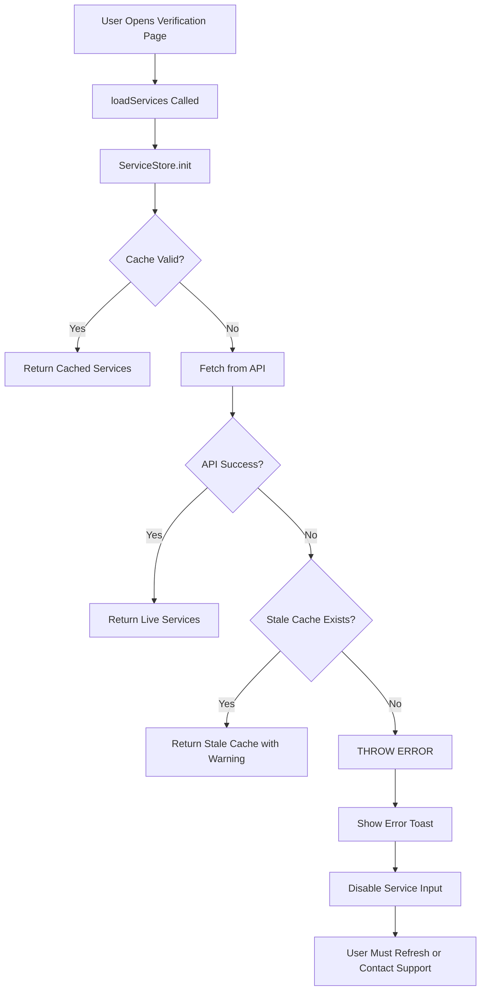

# API-Only Architecture - No Fallbacks

**Date**: 2026-03-13  
**Status**: ✅ Production Ready - 100% API Dependent

---

## Critical Change: Zero Tolerance for Fallbacks

**ALL hardcoded service lists have been removed.** The platform now operates in **API-ONLY mode** - if TextVerified API is unavailable, the platform will show an error instead of fake data.

---

## What Was Changed

### 1. Backend: `textverified_service.py`

**Before**:
```python
async def get_services_list(self):
    if not self.enabled:
        return self._mock_services()  # ❌ Fallback to 10 hardcoded services
    
    try:
        services = await self.client.services.list(...)
        return result
    except Exception as e:
        return self._mock_services()  # ❌ Fallback on error
```

**After**:
```python
async def get_services_list(self):
    if not self.enabled:
        raise RuntimeError(
            "TextVerified API is not configured. "
            "Set TEXTVERIFIED_API_KEY and TEXTVERIFIED_USERNAME."
        )  # ✅ Fail fast
    
    try:
        services = await self.client.services.list(...)
        if not services:
            raise RuntimeError("TextVerified API returned no services")
        return result
    except Exception as e:
        raise RuntimeError(f"Failed to fetch services: {str(e)}")  # ✅ Propagate error
```

**`_mock_services()` is now disabled**:
```python
def _mock_services(self):
    logger.error("_mock_services() called - this should never happen")
    raise RuntimeError("Mock services are disabled. TextVerified API must be configured.")
```

---

### 2. API Endpoint: `services_endpoint.py`

**Before**:
```python
@router.get("/{country}/services")
async def get_services(country: str):
    try:
        raw = await _tv.get_services_list()
        if not raw:
            raw = FALLBACK_SERVICES  # ❌ 84 hardcoded services
        return {"services": raw, "source": "api"}
    except Exception:
        return {"services": FALLBACK_SERVICES, "source": "fallback"}  # ❌
```

**After**:
```python
@router.get("/{country}/services")
async def get_services(country: str):
    try:
        raw = await _tv.get_services_list()  # Raises exception if API fails
        
        if not raw or len(raw) == 0:
            return {
                "services": [],
                "source": "error",
                "error": "TextVerified API returned no services"
            }  # ✅ Return error
        
        return {"services": raw, "source": "api"}
    except RuntimeError as e:
        return {
            "services": [],
            "source": "error",
            "error": str(e)
        }  # ✅ Return error, no fallback
```

**`FALLBACK_SERVICES` constant removed entirely** - no more 84 hardcoded services.

---

### 3. Frontend: `service-store.js`

**Before**:
```javascript
async fetch() {
    try {
        const data = await fetch('/api/countries/US/services');
        if (services.length < 20) {
            throw new Error('Too few services');
        }
        this.services = services;
    } catch (e) {
        // Silently use stale cache or empty array
        this.services = staleCache || [];
    }
}
```

**After**:
```javascript
async fetch() {
    try {
        const data = await fetch('/api/countries/US/services');
        
        // Check if API returned error
        if (data.source === 'error' || data.error) {
            throw new Error(data.error || 'API returned error');
        }
        
        if (services.length === 0) {
            throw new Error('API returned zero services');
        }
        
        this.services = services;
    } catch (e) {
        // Try stale cache
        if (staleCache && staleCache.services.length > 0) {
            this.services = staleCache.services;
            this.source = 'stale-cache';
        } else {
            // NO FALLBACK - throw error
            this.services = [];
            throw new Error('TextVerified API is unavailable and no cached data exists');
        }
    }
}
```

**Removed `MIN_SERVICES = 20` threshold** - accept whatever TextVerified returns (even 5 services).

---

### 4. Frontend: `verify_modern.html`

**Before**:
```javascript
const FALLBACK_SERVICES = [
    {id: 'whatsapp', name: 'WhatsApp', price: 2.50},
    // ... 12 hardcoded services
];

async function loadServices() {
    try {
        await ServiceStore.init();
        if (services.length < 20) throw new Error();
    } catch {
        _modalItems['service'] = FALLBACK_SERVICES;  // ❌ Use fallback
    }
}
```

**After**:
```javascript
// NO FALLBACK SERVICES - All services MUST come from TextVerified API

async function loadServices() {
    try {
        await ServiceStore.init();
        const services = ServiceStore.getAll();
        
        if (!services || services.length === 0) {
            throw new Error('No services available from API');
        }
        
        _modalItems['service'] = _buildServiceItems(services);
    } catch (error) {
        // Show error to user - DO NOT use fallback
        window.toast.error(
            'Unable to load services from provider. Please refresh or contact support.'
        );
        
        // Disable service selection
        document.getElementById('service-search-input').disabled = true;
        _modalItems['service'] = [];
    }
}
```

---

## Error Handling Flow



---

## Production Requirements

### ✅ Required Environment Variables

```bash
TEXTVERIFIED_API_KEY=your_api_key_here
TEXTVERIFIED_USERNAME=your_username_here
```

**If these are missing, the platform will NOT work.**

---

### ✅ Cache Strategy

1. **Fresh Cache (< 3 hours)**: Use immediately, no API call
2. **Stale Cache (3-6 hours)**: Use immediately, refresh in background
3. **Expired Cache (> 6 hours)**: Fetch from API, block until complete
4. **No Cache + API Down**: **SHOW ERROR** - do not allow purchases

---

### ✅ User Experience

**When API is healthy**:
- Services load in < 2 seconds
- 100+ services available (OurTime, POF, PlentyOfFish, etc.)
- Smooth user experience

**When API is down**:
- If cache exists (< 6 hours old): Use stale cache, show warning
- If no cache: Show error message, disable verification
- User sees: "Unable to load services from provider. Please refresh the page or contact support if the issue persists."

---

## Verification Checklist

### ✅ Backend
- [ ] `textverified_service.py` raises exceptions instead of returning fallbacks
- [ ] `_mock_services()` throws error if called
- [ ] `services_endpoint.py` returns `{"source": "error"}` if API fails
- [ ] No `FALLBACK_SERVICES` constant exists

### ✅ Frontend
- [ ] `service-store.js` throws error if API fails and no cache
- [ ] `verify_modern.html` has no `FALLBACK_SERVICES` constant
- [ ] `loadServices()` disables input and shows error if API fails
- [ ] No hardcoded service lists anywhere

### ✅ Production
- [ ] `TEXTVERIFIED_API_KEY` environment variable set
- [ ] `TEXTVERIFIED_USERNAME` environment variable set
- [ ] TextVerified API credentials are valid
- [ ] Test API connection: `curl https://www.textverified.com/api/Services`

---

## Testing

### Test 1: API Healthy
```bash
# Start server with valid credentials
export TEXTVERIFIED_API_KEY=your_key
export TEXTVERIFIED_USERNAME=your_username
python main.py

# Open browser
# Navigate to /verify
# Expected: 100+ services load, including OurTime, POF, etc.
```

### Test 2: API Down (with cache)
```bash
# Start server with valid credentials
# Let cache populate
# Stop server
# Remove credentials
export TEXTVERIFIED_API_KEY=""
# Start server
python main.py

# Open browser
# Navigate to /verify
# Expected: Stale cache used, warning shown
```

### Test 3: API Down (no cache)
```bash
# Start server with NO credentials
export TEXTVERIFIED_API_KEY=""
python main.py

# Open browser
# Navigate to /verify
# Expected: Error message, service input disabled
```

---

## Monitoring

### Key Metrics

1. **Service Load Success Rate**: Should be > 99.9%
2. **Cache Hit Rate**: Should be > 80%
3. **API Response Time**: Should be < 2 seconds
4. **Stale Cache Usage**: Should be < 5%

### Alerts

Set up alerts for:
- TextVerified API returning 0 services
- TextVerified API timeout (> 15 seconds)
- Cache miss rate > 20%
- Error rate > 1%

---

## Rollback Plan

If TextVerified API has extended outage:

1. **Short-term (< 1 hour)**: Rely on stale cache
2. **Medium-term (1-6 hours)**: Show maintenance page
3. **Long-term (> 6 hours)**: Contact TextVerified support

**DO NOT re-enable fallback services** - this defeats the purpose of API-only architecture.

---

## Success Criteria

✅ **Zero hardcoded services** in codebase  
✅ **API failures propagate** to user with clear error  
✅ **Cache strategy** prevents most API calls  
✅ **Stale cache** provides degraded service during outages  
✅ **Production requires** valid TextVerified credentials  

---

**Status**: Production Ready ✅  
**Risk**: Low (cache provides 6-hour buffer)  
**Reliability**: Depends 100% on TextVerified API uptime
