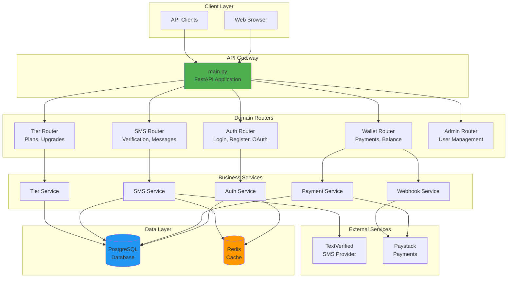
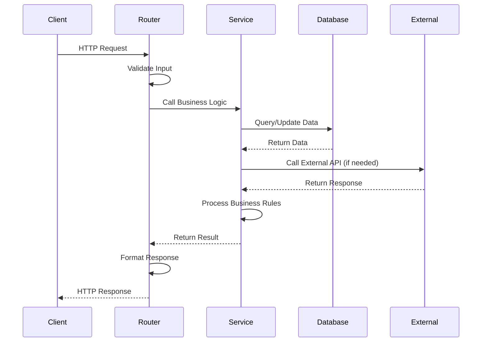
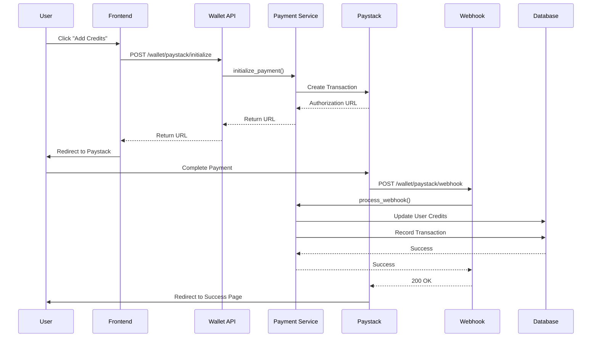
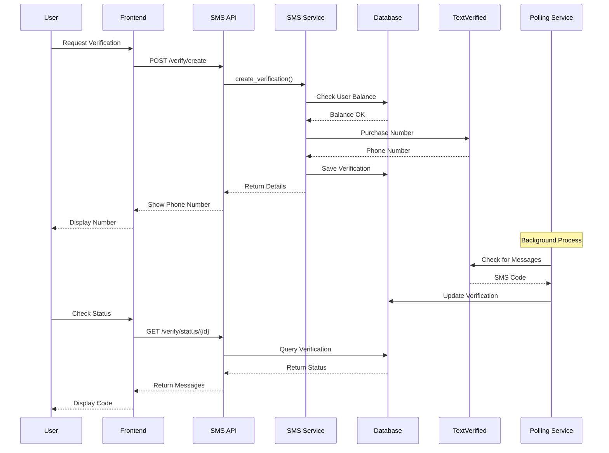
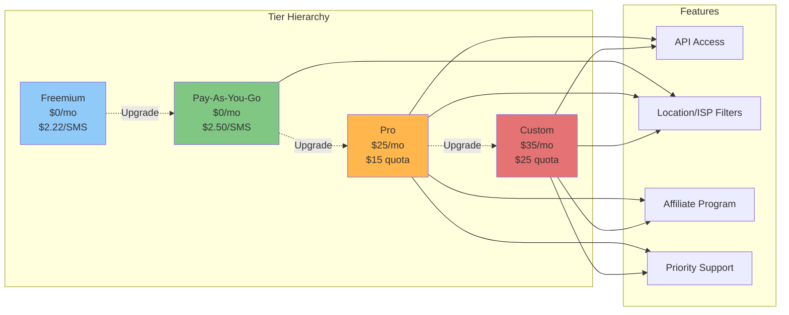
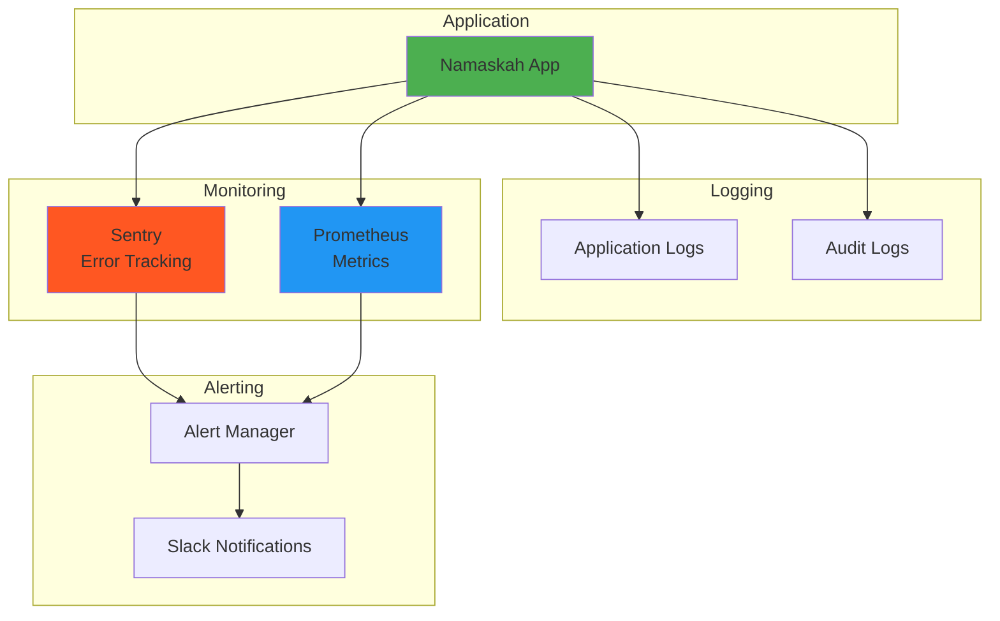
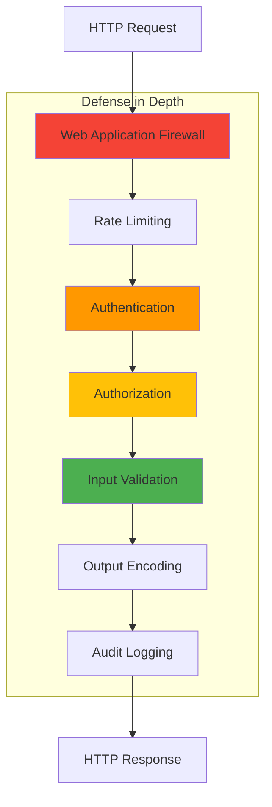

# Namaskah SMS Verification Platform

**Version**: 4.0.0 - Modular Monolith Architecture 🚀  
**Status**: Production Ready  
**Last Updated**: January 18, 2026


---

## 🏗️ Architecture Overview

Namaskah follows a **Modular Monolith** architecture pattern, providing the benefits of microservices organization while maintaining the simplicity of a monolithic deployment.



---

## 🎯 Modular Monolith Benefits

### ✅ Advantages
- **Clear Boundaries**: Each domain has its own router and service layer
- **Easy Testing**: Modules can be tested independently
- **Simple Deployment**: Single application, no orchestration needed
- **Shared Resources**: Efficient database connection pooling
- **Gradual Migration**: Can extract to microservices later if needed

### 📦 Module Structure

```
app/
├── api/                    # API Layer (Routers)
│   ├── core/              # Core domain routers
│   │   ├── auth.py        # Authentication & Authorization
│   │   ├── wallet.py      # Wallet & Payments
│   │   ├── countries.py   # Country & Service listings
│   │   └── verification.py # SMS Verification
│   ├── admin/             # Admin domain
│   │   ├── admin.py       # User management
│   │   ├── kyc.py         # KYC verification
│   │   └── support.py     # Support tickets
│   └── billing/           # Billing domain
│       └── tiers.py       # Tier management
│
├── services/              # Business Logic Layer
│   ├── auth_service.py    # Auth business logic
│   ├── payment_service.py # Payment processing
│   ├── sms_service.py     # SMS verification logic
│   ├── tier_service.py    # Tier calculations
│   └── webhook_service.py # Webhook handling
│
├── models/                # Data Layer
│   ├── user.py           # User model
│   ├── transaction.py    # Transaction model
│   ├── verification.py   # Verification model
│   └── subscription_tier.py # Tier model
│
├── core/                  # Shared Infrastructure
│   ├── database.py       # Database connection
│   ├── cache.py          # Redis cache
│   ├── config.py         # Configuration
│   └── dependencies.py   # Shared dependencies
│
└── middleware/            # Cross-cutting Concerns
    ├── auth.py           # Auth middleware
    ├── rate_limiting.py  # Rate limiting
    └── logging.py        # Request logging
```

---

## 🔄 Request Flow



---

## 💳 Payment Flow



---

## 📱 SMS Verification Flow



---

## 🎯 Tier System



### Tier Comparison

| Feature | Freemium | Pay-As-You-Go | Pro | Custom |
|---------|----------|---------------|-----|--------|
| **Price** | $0/mo | $0/mo | $25/mo | $35/mo |
| **SMS Rate** | $2.22/SMS | $2.50/SMS | $0.30 overage | $0.20 overage |
| **Monthly Quota** | None | None | $15 | $25 |
| **API Access** | ❌ | ❌ | ✅ 10 keys | ✅ Unlimited |
| **Location Filters** | ❌ | ✅ +$0.25 | ✅ Included | ✅ Included |
| **ISP Filters** | ❌ | ✅ +$0.50 | ✅ Included | ✅ Included |
| **Affiliate Program** | ❌ | ❌ | ✅ Standard | ✅ Enhanced |
| **Support** | Community | Community | Priority | Dedicated |

---

## 🚀 Quick Start

### Prerequisites
```bash
# Required
Python 3.9+
PostgreSQL 13+
Redis 6+

# Optional
Docker & Docker Compose
Node.js 18+ (for frontend build)
```

### Installation

```bash
# 1. Clone repository
git clone https://github.com/yourusername/namaskah-sms.git
cd namaskah-sms

# 2. Create virtual environment
python3 -m venv .venv
source .venv/bin/activate  # On Windows: .venv\Scripts\activate

# 3. Install dependencies
pip install -r requirements.txt

# 4. Setup environment
cp .env.example .env
# Edit .env with your configuration

# 5. Initialize database
python scripts/fix_production_schema.py

# 6. Run application
./start.sh
# or
uvicorn main:app --host 127.0.0.1 --port 8000 --reload
```

**Open**: `http://localhost:8000`

---

## 🔌 API Endpoints

### Authentication
```http
POST   /api/auth/register          # Create account
POST   /api/auth/login             # Login
POST   /api/auth/refresh           # Refresh token
POST   /api/auth/logout            # Logout
GET    /api/auth/me                # Get current user
POST   /api/auth/google            # Google OAuth
```

### Wallet & Payments
```http
GET    /api/wallet/balance         # Get balance
POST   /api/wallet/paystack/initialize  # Initialize payment
POST   /api/wallet/paystack/verify      # Verify payment
POST   /api/wallet/paystack/webhook     # Payment webhook
GET    /api/wallet/transactions    # Transaction history
GET    /api/wallet/transactions/export  # Export transactions
```

### SMS Verification
```http
POST   /api/verify/create          # Create verification
GET    /api/verify/status/{id}     # Check status
GET    /api/verify/{id}/messages   # Get messages
GET    /api/verify/history         # Verification history
```

### Tiers
```http
GET    /api/tiers                  # List tiers
GET    /api/tiers/current          # Current tier
POST   /api/tiers/upgrade          # Upgrade tier
POST   /api/tiers/downgrade        # Downgrade tier
```

### API Keys (Pro+)
```http
GET    /api/keys                   # List API keys
POST   /api/keys/generate          # Generate key
DELETE /api/keys/{id}              # Revoke key
GET    /api/keys/{id}/usage        # Usage stats
```

### Countries & Services
```http
GET    /api/countries              # List countries
GET    /api/countries/{code}/services  # Get services
GET    /api/services               # List all services
```

---

## 🧪 Testing

### Run Tests
```bash
# All tests
pytest

# With coverage
pytest --cov=app --cov-report=html

# Specific module
pytest tests/unit/test_wallet_service.py -v

# Frontend tests
npm run test:e2e
```

### Test Structure
```
tests/
├── unit/                  # Unit tests (95% coverage target)
│   ├── test_wallet_service.py
│   ├── test_payment_service.py
│   ├── test_sms_service.py
│   └── test_tier_calculations.py
├── integration/           # Integration tests (85% coverage)
│   ├── test_wallet_api.py
│   ├── test_payment_flow.py
│   └── test_verification_flow.py
├── frontend/              # Frontend tests (70% coverage)
│   ├── test_login_page.spec.js
│   ├── test_dashboard.spec.js
│   └── test_verification_flow.spec.js
└── e2e/                   # End-to-end tests
    └── test_user_journeys.py
```

### Coverage Report
```bash
# Generate HTML coverage report
pytest --cov=app --cov-report=html
open htmlcov/index.html

# Current coverage: 81.48%
# Target coverage: 90%+
```

---

## 📊 Monitoring & Observability



---

## 🔒 Security Features

### OWASP Top 10 Compliance
- ✅ **A01: Broken Access Control** - Role-based access control (RBAC)
- ✅ **A02: Cryptographic Failures** - Bcrypt password hashing, JWT tokens
- ✅ **A03: Injection** - SQLAlchemy ORM, parameterized queries
- ✅ **A04: Insecure Design** - Secure by design architecture
- ✅ **A05: Security Misconfiguration** - Environment-based config
- ✅ **A06: Vulnerable Components** - Regular dependency updates
- ✅ **A07: Authentication Failures** - JWT + OAuth2, rate limiting
- ✅ **A08: Software Integrity** - Code signing, dependency verification
- ✅ **A09: Logging Failures** - Comprehensive audit logging
- ✅ **A10: SSRF** - Input validation, URL whitelisting

### Security Layers


---

## 🚢 Deployment

### Docker Compose (Recommended)
```bash
# Development
docker-compose up

# Production
docker-compose -f docker-compose.production.yml up -d
```

### Kubernetes
```bash
# Apply configuration
kubectl apply -f k8s-deployment.yaml

# Check status
kubectl get pods -l app=namaskah-sms

# View logs
kubectl logs -f deployment/namaskah-sms
```

### Manual Deployment
```bash
# Install dependencies
pip install -r requirements.txt

# Run with Gunicorn
gunicorn main:app \
  -w 4 \
  -k uvicorn.workers.UvicornWorker \
  --bind 0.0.0.0:8000 \
  --access-logfile - \
  --error-logfile -
```

### Render.com (Current Production)
```yaml
# render.yaml
services:
  - type: web
    name: namaskah-sms
    env: python
    buildCommand: pip install -r requirements.txt
    startCommand: uvicorn main:app --host 0.0.0.0 --port $PORT --workers 2
    envVars:
      - key: DATABASE_URL
      - key: SECRET_KEY
      - key: JWT_SECRET_KEY
```

---

## 📚 Documentation

- [API Guide](docs/API_GUIDE.md) - Complete API reference
- [Testing Guide](.kiro/TESTING_IMPROVEMENT_PLAN.md) - Testing strategy
- [Deployment Guide](.kiro/PRODUCTION_DEPLOYMENT_PLAN.md) - Deployment instructions
- [Security Guide](docs/SECURITY_AND_COMPLIANCE.md) - Security details
- [Database Guide](.kiro/PRODUCTION_DATABASE_GUIDE.md) - Database management
- [Workflow Roadmap](WORKFLOW_IMPROVEMENT_ROADMAP.md) - CI/CD improvements & timeline
- [Quick Fixes](WORKFLOW_QUICK_FIXES.md) - Week 1-2 critical fixes

---

## 🛣️ Roadmap

### Completed Phases ✅

See [CHANGELOG.md](./CHANGELOG.md) for detailed features of completed phases:

- **Phase 1** (Dec 2025): Foundation & Infrastructure
- **Phase 2** (Jan 2026): Core Platform Features  
- **Phase 2.5** (Jan 26, 2026): Notification System (300x faster delivery, 100+ test cases)

### Current & Upcoming

### Q1 2026 - Foundation 🔄
- 🔄 **Payment flow hardening** (race condition fixes, idempotency)
- 🔄 **Security hardening** (blocking scans, vulnerability elimination)
- 🔄 **Test coverage** (23% → 50%)
- 🔄 **Enable integration tests** (PostgreSQL, Redis)
- 🔄 **E2E smoke tests** (critical user journeys)

### Q2 2026 - Reliability 📋
- 📋 SDK libraries (Python, JavaScript, Go)
- 📋 Webhook builder with persistent queue
- 📋 Enhanced analytics dashboard
- 📋 Referral program
- 📋 **Distributed tracing** (OpenTelemetry)
- 📋 **Performance testing** (Locust, p95 < 500ms)
- 📋 **API contract testing** (Schemathesis)
- 📋 **Container security** (Trivy scanning)
- 📋 **Blue-green deployments**

### Q3 2026 - Optimization 📋
- 📋 Geographic targeting improvements
- 📋 Device type filtering
- 📋 Team management features
- 📋 SSO integration
- 📋 **Multi-region deployment**
- 📋 **Chaos engineering** (failure scenario testing)
- 📋 **Advanced testing** (property-based, mutation, fuzz)
- 📋 **Test coverage** (70% → 85%)

### Q4 2026 - Excellence 📋
- 📋 Enterprise tier
- 📋 White-label options
- 📋 Advanced reporting
- 📋 Multi-currency support
- 📋 **SOC 2 compliance automation**
- 📋 **Circuit breakers & bulkheads**
- 📋 **SLO-based monitoring**
- 📋 **Test coverage** (85% → 90%)

**See [WORKFLOW_IMPROVEMENT_ROADMAP.md](./WORKFLOW_IMPROVEMENT_ROADMAP.md) for detailed timeline**

---

## 🤝 Contributing

We welcome contributions! Please see our [Contributing Guide](CONTRIBUTING.md).

### Development Setup
```bash
# Install dev dependencies
pip install -r requirements-dev.txt

# Install pre-commit hooks
pre-commit install

# Run linters
black app/
flake8 app/
mypy app/

# Run tests
pytest
```

---

## 📄 License

MIT License - See [LICENSE](./LICENSE) file

---

## 🙏 Acknowledgments

- **FastAPI** - Modern Python web framework
- **SQLAlchemy** - Python SQL toolkit
- **TextVerified** - SMS provider
- **Paystack** - Payment processing
- **Render.com** - Hosting platform

---

## 📞 Support

- **Community**: [GitHub Discussions](https://github.com/yourusername/namaskah-sms/discussions)
- **Email**: support@namaskah.app
- **Documentation**: https://docs.namaskah.app
- **Status Page**: https://status.namaskah.app

---

**Built with ❤️ by the Namaskah Team**

**Ready to verify? [Get Started →](https://namaskah.app)**
