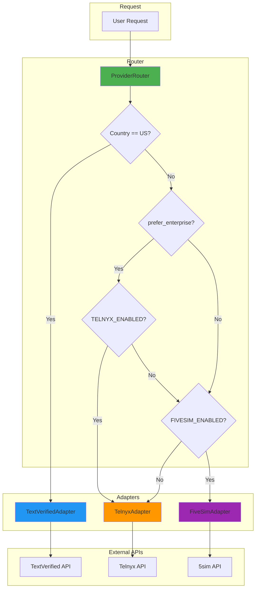
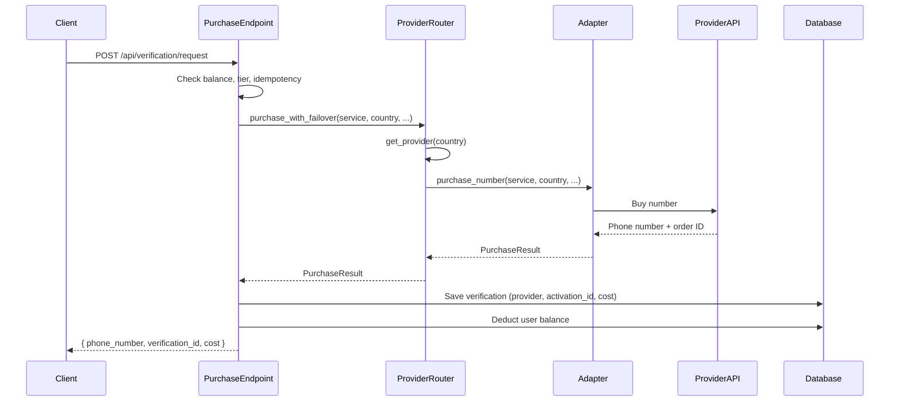
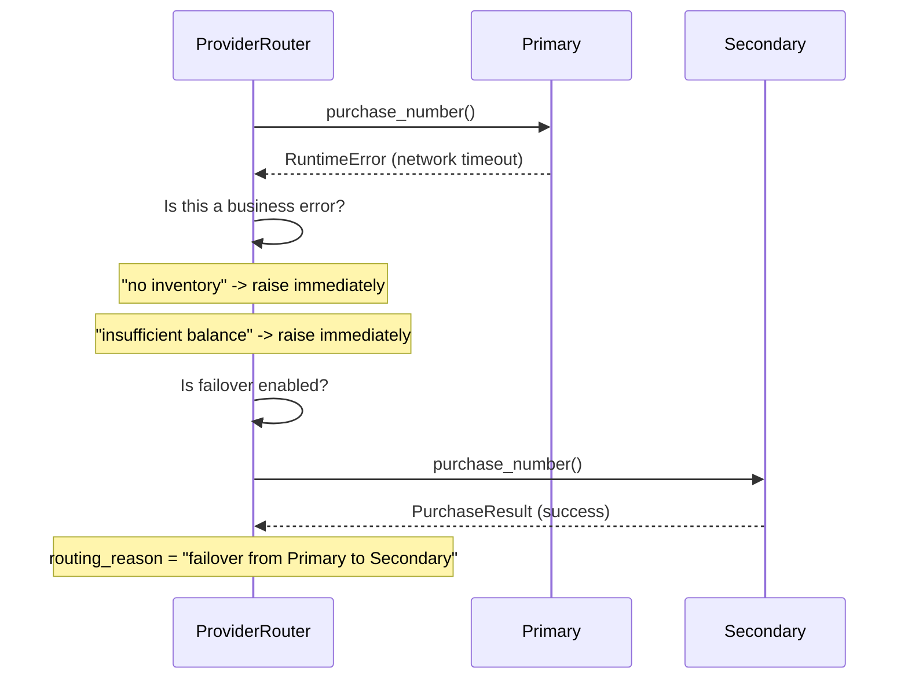
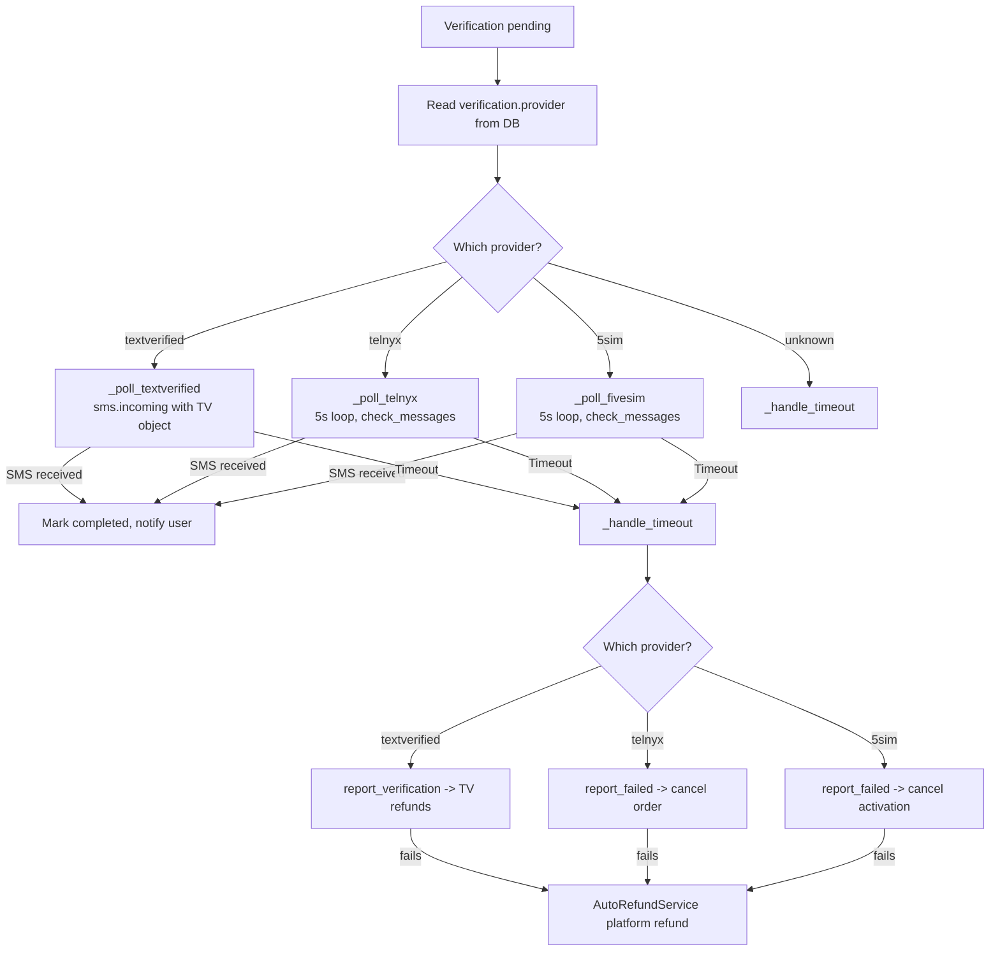
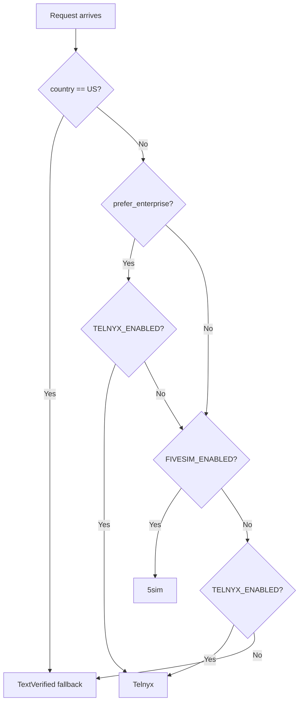
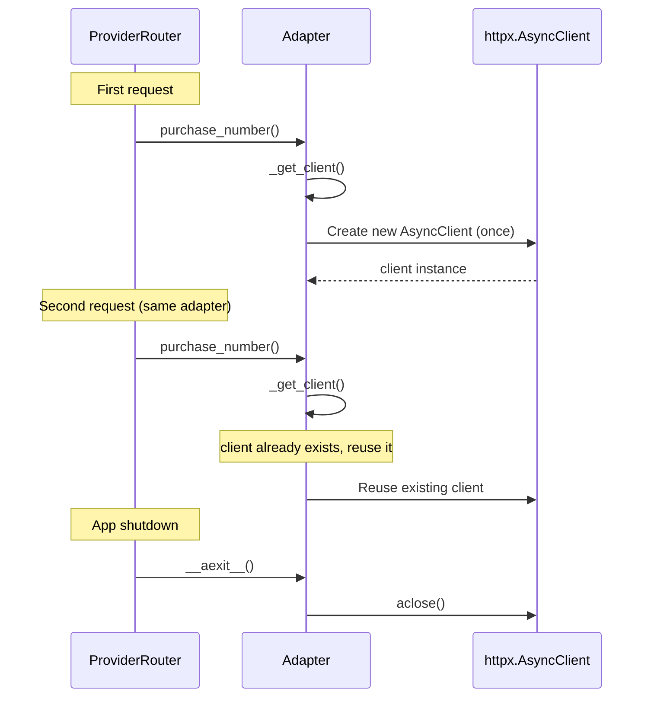
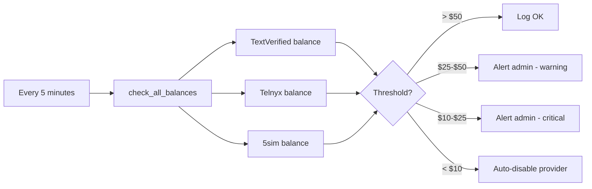

# Multi-Provider Routing — Architecture Diagrams

Diagrams for the smart multi-provider routing system.
Implementation details -> docs/tasks/SMART_MULTI_PROVIDER_ROUTING.md

---

## System Architecture

---

## Purchase Flow

---

## Failover Flow

---

## Polling Dispatch

---

## Provider Selection Logic

---

## HTTP Client Lifecycle

---

## Balance Monitoring (Outstanding — Phase 4)

