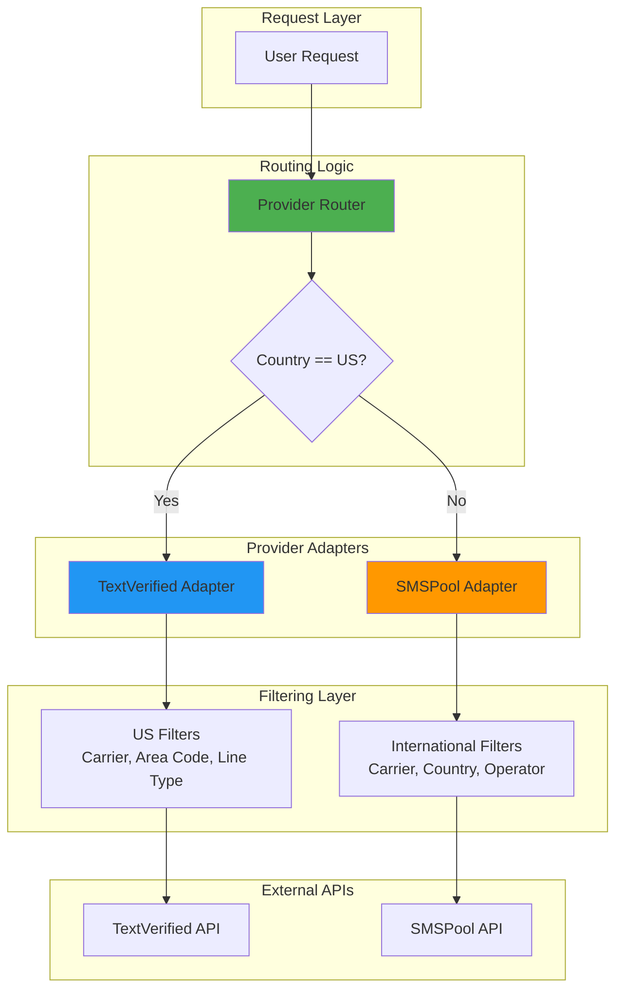

# SMSPool Integration Task

**Version**: 1.0.0  
**Status**: Planning  
**Priority**: High  
**Estimated Effort**: 3-4 weeks  
**Target Release**: Q2 2026

---

## 🎯 Objective

Integrate SMSPool API as the international SMS provider to route non-US verification requests, implementing comprehensive filtering (carrier, state, line type) to maintain feature parity with TextVerified's US capabilities.

---

## 📋 Business Requirements

### Primary Goals
1. **Geographic Routing**: Automatically route international requests to SMSPool
2. **Feature Parity**: Implement carrier/state/line-type filtering for international numbers
3. **Cost Optimization**: Leverage SMSPool's competitive international pricing
4. **User Experience**: Seamless transition between providers (transparent to users)

### Success Metrics
- 90%+ international verification success rate
- <3s average number acquisition time
- 100% carrier filter accuracy
- Zero manual routing intervention

---

## 🏗️ Technical Architecture



---

## 📦 Implementation Phases

### Phase 1: SMSPool API Integration (Week 1)

#### 1.1 API Client Implementation
**File**: `app/integrations/smspool_client.py`

```python
class SMSPoolClient:
    """SMSPool API client for international SMS verification"""
    
    def __init__(self, api_key: str):
        self.api_key = api_key
        self.base_url = "https://api.smspool.net"
    
    async def get_success_rates(self, service_id: int) -> dict:
        """Get success rates by country/operator"""
        pass
    
    async def carrier_lookup(self, phone_number: str) -> dict:
        """Paid carrier lookup for filtering"""
        pass
    
    async def purchase_number(self, country: str, service: str, 
                             carrier: Optional[str] = None) -> dict:
        """Purchase number with optional carrier filter"""
        pass
    
    async def check_sms(self, order_id: str) -> dict:
        """Check for received SMS"""
        pass
    
    async def get_balance(self) -> float:
        """Get account balance"""
        pass
```

#### 1.2 Configuration
**File**: `app/core/config.py`

```python
# SMSPool Configuration
SMSPOOL_API_KEY: str = Field(..., env="SMSPOOL_API_KEY")
SMSPOOL_ENABLED: bool = Field(default=True, env="SMSPOOL_ENABLED")
SMSPOOL_TIMEOUT: int = Field(default=30, env="SMSPOOL_TIMEOUT")
SMSPOOL_MAX_RETRIES: int = Field(default=3, env="SMSPOOL_MAX_RETRIES")
```

#### 1.3 Database Schema Updates
**File**: `app/models/verification.py`

```python
# Add to Verification model
provider: str = Column(String(20), nullable=False, default="textverified")
provider_order_id: str = Column(String(100), nullable=True)
provider_metadata: JSON = Column(JSON, nullable=True)
```

**Migration**: `alembic/versions/xxx_add_smspool_support.py`

---

### Phase 2: Provider Abstraction Layer (Week 1-2)

#### 2.1 Provider Interface
**File**: `app/services/providers/base_provider.py`

```python
from abc import ABC, abstractmethod
from typing import Optional, Dict, List

class SMSProvider(ABC):
    """Abstract base class for SMS providers"""
    
    @abstractmethod
    async def purchase_number(
        self,
        country_code: str,
        service: str,
        filters: Optional[Dict] = None
    ) -> Dict:
        """Purchase a phone number"""
        pass
    
    @abstractmethod
    async def check_messages(self, verification_id: str) -> List[Dict]:
        """Check for received messages"""
        pass
    
    @abstractmethod
    async def carrier_lookup(self, phone_number: str) -> Dict:
        """Lookup carrier information"""
        pass
    
    @abstractmethod
    async def get_balance(self) -> float:
        """Get provider balance"""
        pass
```

#### 2.2 TextVerified Adapter
**File**: `app/services/providers/textverified_provider.py`

```python
class TextVerifiedProvider(SMSProvider):
    """TextVerified implementation (existing logic refactored)"""
    
    async def purchase_number(self, country_code: str, service: str, 
                             filters: Optional[Dict] = None) -> Dict:
        # Existing TextVerified logic
        pass
```

#### 2.3 SMSPool Adapter
**File**: `app/services/providers/smspool_provider.py`

```python
from typing import Dict, List, Optional, Any
import asyncio
import httpx
from datetime import datetime, timezone

from app.core.logging import get_logger
from app.services.providers.base_provider import SMSProvider

logger = get_logger(__name__)

class SMSPoolProvider(SMSProvider):
    """SMSPool implementation for international numbers.
    
    CRITICAL API ENDPOINTS (from app.log analysis):
    1. /request/success_rate - Get best operators by country/service
    2. /carrier/paid_lookup - Pre-validate carrier/line type ($0.005/lookup)
    3. /order/sms - Purchase number with operator filter
    4. /sms/check - Poll for received SMS
    
    FILTERING IMPLEMENTATION:
    - Country: Direct parameter (GB, DE, FR, etc.)
    - Carrier/Operator: Use operator parameter in purchase
    - State/City: NOT SUPPORTED (country-level only)
    - Line Type: Pre-validate with paid_lookup before purchase
    
    COST STRUCTURE:
    - SMS: $0.10-$3.00 per message (country-dependent)
    - Carrier Lookup: $0.005 per lookup
    - Success Rate Query: FREE
    """
    
    def __init__(self, api_key: str):
        self.api_key = api_key
        self.base_url = "https://api.smspool.net"
        self.client = httpx.AsyncClient(timeout=30.0)
    
    async def purchase_number(
        self,
        country_code: str,
        service: str,
        filters: Optional[Dict] = None
    ) -> Dict[str, Any]:
        """Purchase number from SMSPool with operator filtering.
        
        Args:
            country_code: ISO country code (GB, DE, FR, etc.)
            service: Service name (telegram, whatsapp, etc.)
            filters: {"operator": str, "line_type": str}
        
        Returns:
            {
                "phone_number": str,
                "order_id": str,
                "expires_at": str (ISO format),
                "provider": "smspool",
                "operator": str,
                "cost": float
            }
        """
        filters = filters or {}
        operator = filters.get("operator")
        required_line_type = filters.get("line_type", "mobile")
        
        # Step 1: Get best operator if not specified
        if not operator:
            operator = await self._auto_select_operator(country_code, service)
            logger.info(f"Auto-selected operator: {operator} for {country_code}/{service}")
        
        # Step 2: Purchase number
        try:
            response = await self.client.post(
                f"{self.base_url}/order/sms",
                json={
                    "key": self.api_key,
                    "country": country_code,
                    "service": service,
                    "operator": operator,  # CRITICAL: Carrier filter
                },
            )
            response.raise_for_status()
            data = response.json()
            
            if data.get("success") != 1:
                raise Exception(f"SMSPool purchase failed: {data.get('message')}")
            
            phone_number = data["number"]
            order_id = data["order_id"]
            
            # Step 3: Validate line type (optional, costs $0.005)
            if required_line_type == "mobile":
                validation = await self._validate_line_type(phone_number, required_line_type)
                if not validation["valid"]:
                    # Cancel order and raise error
                    await self._cancel_order(order_id)
                    raise Exception(
                        f"Number {phone_number} is {validation['carrier_type']}, not mobile"
                    )
            
            return {
                "phone_number": phone_number,
                "order_id": order_id,
                "expires_at": datetime.now(timezone.utc).isoformat(),
                "provider": "smspool",
                "operator": operator,
                "cost": data.get("cost", 0.0),
            }
        
        except httpx.HTTPError as e:
            logger.error(f"SMSPool API error: {e}")
            raise Exception(f"Failed to purchase number: {e}")
    
    async def check_messages(self, order_id: str) -> List[Dict]:
        """Check for received SMS messages.
        
        Args:
            order_id: SMSPool order ID
        
        Returns:
            [{"text": str, "code": str, "received_at": str}]
        """
        try:
            response = await self.client.post(
                f"{self.base_url}/sms/check",
                json={"key": self.api_key, "orderid": order_id},
            )
            response.raise_for_status()
            data = response.json()
            
            if data.get("status") == 3:  # Message received
                return [{
                    "text": data.get("sms", ""),
                    "code": data.get("full_sms", ""),  # SMSPool returns full SMS
                    "received_at": datetime.now(timezone.utc).isoformat(),
                }]
            
            return []  # No messages yet
        
        except httpx.HTTPError as e:
            logger.error(f"SMSPool check messages error: {e}")
            return []
    
    async def carrier_lookup(self, phone_number: str) -> Dict[str, Any]:
        """Lookup carrier information (PAID: $0.005 per lookup).
        
        CRITICAL: This is the PRIMARY mechanism for carrier filtering.
        Use this BEFORE purchase to validate carrier/line type.
        
        Args:
            phone_number: Phone number to lookup
        
        Returns:
            {
                "carrier": str,
                "carrier_type": str (mobile/landline/voip),
                "country": str,
                "cost": 0.005
            }
        """
        try:
            response = await self.client.post(
                f"{self.base_url}/carrier/paid_lookup",
                json={"key": self.api_key, "number": phone_number},
            )
            response.raise_for_status()
            data = response.json()
            
            return {
                "carrier": data.get("carrier"),
                "carrier_type": data.get("carrier_type"),
                "country": data.get("country"),
                "cost": 0.005,
            }
        
        except httpx.HTTPError as e:
            logger.error(f"SMSPool carrier lookup error: {e}")
            return {"error": str(e)}
    
    async def get_balance(self) -> float:
        """Get SMSPool account balance."""
        try:
            response = await self.client.post(
                f"{self.base_url}/account/balance",
                json={"key": self.api_key},
            )
            response.raise_for_status()
            data = response.json()
            return float(data.get("balance", 0.0))
        
        except httpx.HTTPError as e:
            logger.error(f"SMSPool balance error: {e}")
            return 0.0
    
    async def _auto_select_operator(
        self,
        country_code: str,
        service: str,
        min_success_rate: float = 0.85
    ) -> Optional[str]:
        """Auto-select best operator using success_rate endpoint.
        
        CRITICAL: This is FREE and improves success rates significantly.
        
        Args:
            country_code: ISO country code
            service: Service name
            min_success_rate: Minimum acceptable success rate (0.0-1.0)
        
        Returns:
            Operator name or None
        """
        try:
            response = await self.client.get(
                f"{self.base_url}/request/success_rate",
                params={"key": self.api_key, "service": service},
            )
            response.raise_for_status()
            data = response.json()
            
            # Get operators for this country
            country_data = data.get(country_code, {})
            
            # Sort by success rate
            operators = sorted(
                country_data.items(),
                key=lambda x: x[1].get("success_rate", 0),
                reverse=True,
            )
            
            # Return first operator above threshold
            for operator, stats in operators:
                if stats.get("success_rate", 0) >= min_success_rate:
                    logger.info(
                        f"Selected {operator} for {country_code}: "
                        f"{stats['success_rate']*100:.1f}% success rate"
                    )
                    return operator
            
            # Fallback: return highest rated operator
            if operators:
                return operators[0][0]
            
            return None
        
        except httpx.HTTPError as e:
            logger.error(f"SMSPool success rate query error: {e}")
            return None
    
    async def _validate_line_type(
        self,
        phone_number: str,
        required_type: str = "mobile"
    ) -> Dict[str, Any]:
        """Validate line type using paid lookup."""
        lookup = await self.carrier_lookup(phone_number)
        
        is_valid = lookup.get("carrier_type", "").lower() == required_type.lower()
        
        return {
            "valid": is_valid,
            "carrier": lookup.get("carrier"),
            "carrier_type": lookup.get("carrier_type"),
            "country": lookup.get("country"),
        }
    
    async def _cancel_order(self, order_id: str) -> bool:
        """Cancel an order (if number doesn't meet requirements)."""
        try:
            response = await self.client.post(
                f"{self.base_url}/sms/cancel",
                json={"key": self.api_key, "orderid": order_id},
            )
            response.raise_for_status()
            return True
        except httpx.HTTPError as e:
            logger.error(f"SMSPool cancel error: {e}")
            return False
```

#### 2.4 Provider Router
**File**: `app/services/providers/provider_router.py`

```python
class ProviderRouter:
    """Routes requests to appropriate SMS provider"""
    
    def __init__(self):
        self.textverified = TextVerifiedProvider()
        self.smspool = SMSPoolProvider()
    
    def get_provider(self, country_code: str) -> SMSProvider:
        """Select provider based on country"""
        if country_code == "US":
            return self.textverified
        return self.smspool
    
    async def purchase_number(self, country_code: str, service: str,
                             filters: Optional[Dict] = None) -> Dict:
        provider = self.get_provider(country_code)
        return await provider.purchase_number(country_code, service, filters)
```

---

### Phase 3: Filtering Implementation (Week 2)

#### 3.1 SMSPool Filter Mapping
**File**: `app/services/filters/smspool_filters.py`

```python
class SMSPoolFilters:
    """Map Namaskah filters to SMSPool parameters.
    
    CRITICAL CONTEXT FROM CODEBASE ANALYSIS:
    - TextVerified uses: area_code (3-digit US), carrier (verizon/att/tmobile)
    - SMSPool uses: country code, operator name, service ID
    - SMSPool API endpoints:
      * /request/success_rate - Get best operators by country/service
      * /carrier/paid_lookup - Validate carrier/line type BEFORE purchase
      * /order/sms - Purchase with country + operator filter
    
    FILTERING STRATEGY:
    1. Country-based routing (US → TextVerified, International → SMSPool)
    2. Operator mapping (carrier name → SMSPool operator)
    3. Pre-purchase validation (paid_lookup for line type)
    4. Success rate optimization (auto-select best operator)
    """
    
    # US Carrier → International Operator Mapping
    # Maps Namaskah's US carrier names to global operator equivalents
    CARRIER_MAPPING = {
        # US carriers (for reference/future US support via SMSPool)
        "verizon": ["Verizon", "Verizon Wireless"],
        "att": ["AT&T", "AT&T Mobility", "AT&T USA"],
        "tmobile": ["T-Mobile", "T-Mobile USA", "T-Mobile US"],
        
        # UK carriers
        "vodafone_uk": ["Vodafone UK", "Vodafone"],
        "ee": ["EE", "Everything Everywhere"],
        "o2_uk": ["O2 UK", "O2"],
        "three_uk": ["Three UK", "3 UK"],
        
        # Germany carriers
        "vodafone_de": ["Vodafone DE", "Vodafone Germany"],
        "telekom_de": ["Deutsche Telekom", "T-Mobile DE"],
        "o2_de": ["O2 Germany", "Telefonica Germany"],
        
        # France carriers
        "orange_fr": ["Orange France", "Orange"],
        "sfr": ["SFR", "SFR France"],
        "bouygues": ["Bouygues Telecom", "Bouygues"],
        
        # India carriers
        "airtel": ["Airtel", "Bharti Airtel"],
        "jio": ["Jio", "Reliance Jio"],
        "vodafone_idea": ["Vodafone Idea", "Vi"],
        
        # Canada carriers
        "rogers": ["Rogers", "Rogers Wireless"],
        "bell": ["Bell", "Bell Mobility"],
        "telus": ["Telus", "Telus Mobility"],
    }
    
    # State/Region → Country mapping for international requests
    # SMSPool doesn't have US state filtering, but has country-level
    STATE_TO_COUNTRY = {
        # US states map to US (handled by TextVerified)
        "CA": "US", "NY": "US", "TX": "US", "FL": "US",
        # UK regions
        "LONDON": "GB", "ENGLAND": "GB", "SCOTLAND": "GB",
        # Germany regions
        "BERLIN": "DE", "MUNICH": "DE", "HAMBURG": "DE",
    }
    
    @staticmethod
    def apply_carrier_filter(country: str, carrier: Optional[str]) -> Optional[str]:
        """Convert Namaskah carrier name to SMSPool operator.
        
        Args:
            country: ISO country code (GB, DE, FR, etc.)
            carrier: Namaskah carrier name (verizon, vodafone_uk, etc.)
        
        Returns:
            SMSPool operator name or None
        """
        if not carrier:
            return None
        
        # Normalize carrier name
        carrier_normalized = carrier.lower().replace(" ", "_").replace("-", "")
        
        # Get operator variants
        operators = SMSPoolFilters.CARRIER_MAPPING.get(carrier_normalized, [])
        
        if not operators:
            logger.warning(f"Unknown carrier: {carrier} for country {country}")
            return None
        
        # Return first variant (most common name)
        return operators[0]
    
    @staticmethod
    async def validate_line_type_pre_purchase(
        phone_number: str,
        required_type: str = "mobile"
    ) -> Dict[str, Any]:
        """Validate line type using SMSPool paid_lookup BEFORE purchase.
        
        CRITICAL: This costs $0.005 per lookup but prevents wasted purchases.
        Use this to reject VOIP/landline numbers before buying.
        
        Args:
            phone_number: Phone number to validate
            required_type: Required type (mobile, landline, voip)
        
        Returns:
            {"valid": bool, "carrier": str, "carrier_type": str, "country": str}
        """
        try:
            lookup = await smspool_client.carrier_lookup(phone_number)
            
            is_valid = lookup.get("carrier_type", "").lower() == required_type.lower()
            
            return {
                "valid": is_valid,
                "carrier": lookup.get("carrier"),
                "carrier_type": lookup.get("carrier_type"),
                "country": lookup.get("country"),
                "cost": 0.005  # Lookup cost
            }
        except Exception as e:
            logger.error(f"Carrier lookup failed: {e}")
            return {"valid": False, "error": str(e)}
    
    @staticmethod
    def map_area_code_to_region(area_code: str, country: str = "US") -> Optional[str]:
        """Map US area code to region/state for international equivalent.
        
        SMSPool doesn't support area code filtering, but we can:
        1. For US: Route to TextVerified (keeps area code support)
        2. For International: Ignore area code, use country-level
        
        Args:
            area_code: 3-digit US area code
            country: Country code
        
        Returns:
            Region name or None
        """
        if country != "US":
            logger.info(f"Area code {area_code} ignored for non-US country {country}")
            return None
        
        # US area codes should route to TextVerified
        logger.info(f"Area code {area_code} requires TextVerified (US-only feature)")
        return None
```

#### 3.2 Filter Service Update
**File**: `app/api/verification/purchase_endpoints.py` (modify existing)

```python
# ADD THIS SECTION AFTER LINE 195 (after tier validation)

# PHASE 3.2: Provider Routing Logic
from app.services.providers.provider_router import ProviderRouter

provider_router = ProviderRouter()

# Determine provider based on country
if request.country == "US":
    # US requests → TextVerified (existing logic)
    provider_name = "textverified"
    logger.info(f"Routing to TextVerified for US request")
    
    # Use existing TextVerified logic (lines 215-280)
    textverified_result = await tv_service.create_verification(
        service=request.service,
        country=request.country,
        area_code=area_code,
        carrier=carrier,
    )
else:
    # International requests → SMSPool
    provider_name = "smspool"
    logger.info(f"Routing to SMSPool for international request: {request.country}")
    
    # Map filters to SMSPool format
    from app.services.filters.smspool_filters import SMSPoolFilters
    
    smspool_operator = SMSPoolFilters.apply_carrier_filter(
        country=request.country,
        carrier=carrier
    )
    
    # Get SMSPool provider
    smspool_provider = provider_router.get_provider(request.country)
    
    # Purchase number from SMSPool
    smspool_result = await smspool_provider.purchase_number(
        country_code=request.country,
        service=request.service,
        filters={
            "operator": smspool_operator,
            "line_type": "mobile"  # Always require mobile
        }
    )
    
    # Map SMSPool result to TextVerified format for compatibility
    textverified_result = {
        "id": smspool_result["order_id"],
        "phone_number": smspool_result["phone_number"],
        "cost": smspool_result["cost"],
        "ends_at": smspool_result["expires_at"],
        "retry_attempts": 0,
        "area_code_matched": True,  # N/A for international
        "carrier_matched": bool(smspool_operator),
        "real_carrier": smspool_result.get("operator"),
        "voip_rejected": False,
        "fallback_applied": False,
        "requested_area_code": None,
        "assigned_area_code": None,
        "same_state_fallback": True,
    }

# Continue with existing verification record creation (line 260+)
verification = Verification(
    user_id=user_id,
    service_name=request.service,
    phone_number=textverified_result["phone_number"],
    country=request.country,
    capability=request.capability,
    cost=actual_cost,
    provider=provider_name,  # "textverified" or "smspool"
    activation_id=textverified_result["id"],
    status="pending",
    # ... rest of fields
)
```

---

### Phase 4: Success Rate Intelligence (Week 3)

#### 4.1 Success Rate Caching
**File**: `app/services/success_rate_service.py`

```python
class SuccessRateService:
    """Cache and analyze SMSPool success rates"""
    
    async def get_best_operators(self, country: str, service: str) -> List[Dict]:
        """Get operators sorted by success rate"""
        cache_key = f"success_rates:{country}:{service}"
        
        # Check cache (1 hour TTL)
        cached = await redis.get(cache_key)
        if cached:
            return json.loads(cached)
        
        # Fetch from SMSPool
        rates = await smspool_client.get_success_rates(service_id=service)
        operators = rates.get(country, {})
        
        # Sort by success rate
        sorted_operators = sorted(
            operators.items(),
            key=lambda x: x[1].get("success_rate", 0),
            reverse=True
        )
        
        # Cache result
        await redis.setex(cache_key, 3600, json.dumps(sorted_operators))
        
        return sorted_operators
    
    async def auto_select_operator(self, country: str, service: str,
                                   min_success_rate: float = 0.85) -> Optional[str]:
        """Automatically select best performing operator"""
        operators = await self.get_best_operators(country, service)
        
        for operator, data in operators:
            if data.get("success_rate", 0) >= min_success_rate:
                return operator
        
        return None  # No operator meets threshold
```

#### 4.2 Intelligent Retry Logic
**File**: `app/services/retry_service.py`

```python
async def retry_with_fallback(
    self,
    verification_id: int,
    max_attempts: int = 3
) -> bool:
    """Retry with different operators on failure"""
    
    verification = await self.get_verification(verification_id)
    
    for attempt in range(max_attempts):
        # Get next best operator
        operator = await success_rate_service.auto_select_operator(
            country=verification.country_code,
            service=verification.service
        )
        
        # Attempt purchase with new operator
        result = await smspool_provider.purchase_number(
            country=verification.country_code,
            service=verification.service,
            filters={"carrier": operator}
        )
        
        if result["success"]:
            return True
    
    return False
```

---

### Phase 5: Pricing & Cost Management (Week 3)

#### 5.1 Dynamic Pricing
**File**: `app/services/pricing_service.py`

```python
class PricingService:
    """Calculate costs across providers"""
    
    PROVIDER_MARKUP = {
        "textverified": 1.15,  # 15% markup
        "smspool": 1.20        # 20% markup (higher international costs)
    }
    
    async def calculate_cost(self, country: str, service: str,
                            carrier: Optional[str] = None) -> Decimal:
        """Calculate user-facing cost"""
        
        # Get provider
        provider_name = "textverified" if country == "US" else "smspool"
        
        # Get base cost
        if provider_name == "smspool":
            rates = await smspool_client.get_success_rates(service)
            base_cost = rates.get(country, {}).get(carrier or "default", {}).get("cost", 2.50)
        else:
            base_cost = 2.22  # TextVerified base
        
        # Apply markup
        markup = self.PROVIDER_MARKUP[provider_name]
        final_cost = Decimal(str(base_cost)) * Decimal(str(markup))
        
        return final_cost.quantize(Decimal("0.01"))
```

#### 5.2 Balance Monitoring
**File**: `app/services/balance_monitor.py`

```python
async def check_provider_balances() -> Dict[str, float]:
    """Monitor all provider balances"""
    
    balances = {
        "textverified": await textverified_client.get_balance(),
        "smspool": await smspool_client.get_balance()
    }
    
    # Alert if low
    for provider, balance in balances.items():
        if balance < 100.00:  # $100 threshold
            await send_alert(f"Low balance on {provider}: ${balance}")
    
    return balances
```

---

### Phase 6: API Updates (Week 4)

#### 6.1 Country Selection Endpoint
**File**: `app/api/core/countries.py`

```python
@router.get("/countries/international")
async def get_international_countries(
    service: Optional[str] = None,
    current_user: User = Depends(get_current_user)
):
    """Get available international countries from SMSPool"""
    
    # Get success rates (includes all countries)
    rates = await smspool_client.get_success_rates(service_id=service or 1)
    
    countries = []
    for country_code, operators in rates.items():
        if country_code != "US":  # Exclude US (handled by TextVerified)
            countries.append({
                "code": country_code,
                "name": COUNTRY_NAMES.get(country_code),
                "operators": list(operators.keys()),
                "avg_success_rate": sum(op["success_rate"] for op in operators.values()) / len(operators)
            })
    
    return {"countries": sorted(countries, key=lambda x: x["avg_success_rate"], reverse=True)}
```

#### 6.2 Carrier Filter Endpoint
**File**: `app/api/core/verification.py`

```python
@router.post("/verify/create")
async def create_verification(
    request: VerificationRequest,
    current_user: User = Depends(get_current_user)
):
    """Create verification with automatic provider routing"""
    
    # Validate filters
    filters = {}
    if request.carrier:
        filters["carrier"] = request.carrier
    if request.line_type:
        filters["line_type"] = request.line_type
    
    # Create verification (router handles provider selection)
    verification = await sms_service.create_verification(
        user_id=current_user.id,
        country_code=request.country_code,
        service=request.service,
        filters=filters
    )
    
    return {
        "id": verification.id,
        "phone_number": verification.phone_number,
        "provider": verification.provider,
        "expires_at": verification.expires_at
    }
```

---

## 🧪 Testing Strategy

### Unit Tests
**File**: `tests/unit/test_smspool_provider.py`

```python
class TestSMSPoolProvider:
    async def test_purchase_number_success(self):
        """Test successful number purchase"""
        pass
    
    async def test_carrier_filter_mapping(self):
        """Test carrier filter conversion"""
        pass
    
    async def test_line_type_validation(self):
        """Test line type filtering"""
        pass
    
    async def test_success_rate_caching(self):
        """Test success rate cache"""
        pass
```

### Integration Tests
**File**: `tests/integration/test_provider_routing.py`

```python
class TestProviderRouting:
    async def test_us_routes_to_textverified(self):
        """Verify US requests use TextVerified"""
        pass
    
    async def test_international_routes_to_smspool(self):
        """Verify international requests use SMSPool"""
        pass
    
    async def test_filter_parity(self):
        """Verify filters work across providers"""
        pass
```

### E2E Tests
**File**: `tests/e2e/test_international_verification.py`

```python
async def test_full_international_flow():
    """Test complete international verification"""
    # 1. Request UK number with Vodafone carrier
    # 2. Verify routing to SMSPool
    # 3. Verify carrier filter applied
    # 4. Check message retrieval
    # 5. Verify cost calculation
    pass
```

---

## 📊 Monitoring & Observability

### Metrics to Track
```python
# Provider performance
smspool_purchase_success_rate = Gauge("smspool_purchase_success_rate")
smspool_message_delivery_time = Histogram("smspool_message_delivery_time")
smspool_api_latency = Histogram("smspool_api_latency")

# Cost tracking
smspool_daily_spend = Counter("smspool_daily_spend")
smspool_cost_per_verification = Gauge("smspool_cost_per_verification")

# Routing
provider_routing_decisions = Counter("provider_routing_decisions", ["provider"])
```

### Alerts
- SMSPool API errors > 5% in 5 minutes
- Balance < $100
- Success rate < 85% for any country
- Average delivery time > 30 seconds

---

## 🔒 Security Considerations

1. **API Key Management**: Store SMSPool API key in secrets manager
2. **Rate Limiting**: Implement per-user limits for international requests
3. **Fraud Detection**: Monitor for unusual country/carrier patterns
4. **Data Privacy**: Ensure GDPR compliance for EU numbers
5. **Carrier Lookup Costs**: Cache lookups to minimize paid API calls

---

## 💰 Cost Analysis

### Estimated Costs
- **SMSPool API**: $0.10-$3.00 per SMS (country-dependent)
- **Carrier Lookups**: $0.005 per lookup (cache to reduce)
- **Infrastructure**: Minimal (reuse existing)

### Revenue Impact
- **Markup**: 20% on international SMS
- **Expected Volume**: 500-1000 international verifications/month
- **Projected Revenue**: $250-$600/month additional

---

## 📋 Checklist

### Phase 1: API Integration
- [ ] Create SMSPool client class
- [ ] Add configuration variables
- [ ] Update database schema
- [ ] Write unit tests for client

### Phase 2: Provider Abstraction
- [ ] Create base provider interface
- [ ] Refactor TextVerified to adapter pattern
- [ ] Implement SMSPool adapter
- [ ] Create provider router
- [ ] Write integration tests

### Phase 3: Filtering
- [ ] Map carrier filters to SMSPool operators
- [ ] Implement line type validation
- [ ] Update SMS service with routing logic
- [ ] Test filter accuracy

### Phase 4: Intelligence
- [ ] Implement success rate caching
- [ ] Create auto-selection logic
- [ ] Build retry with fallback
- [ ] Monitor and tune thresholds

### Phase 5: Pricing
- [ ] Implement dynamic pricing
- [ ] Add balance monitoring
- [ ] Create cost tracking
- [ ] Update billing logic

### Phase 6: API Updates
- [ ] Add international country endpoint
- [ ] Update verification creation endpoint
- [ ] Add provider status endpoint
- [ ] Update API documentation

### Testing & Deployment
- [ ] Complete unit test suite (90%+ coverage)
- [ ] Complete integration tests
- [ ] Run E2E tests in staging
- [ ] Load testing (1000 concurrent requests)
- [ ] Deploy to production
- [ ] Monitor for 48 hours

---

## 🚀 Deployment Plan

### Staging Rollout
1. Deploy to staging environment
2. Test with real SMSPool API (test mode)
3. Validate all filters and routing
4. Performance testing

### Production Rollout (Phased)
1. **Week 1**: Enable for 10% of international requests
2. **Week 2**: Increase to 50% if success rate > 90%
3. **Week 3**: Full rollout (100%)
4. **Week 4**: Monitor and optimize

### Rollback Plan
- Feature flag: `SMSPOOL_ENABLED=false`
- Automatic fallback to TextVerified if SMSPool fails
- Database rollback script ready

---

## 📚 Documentation Updates

- [ ] Update API documentation with international endpoints
- [ ] Add SMSPool to architecture diagrams
- [ ] Create international verification guide
- [ ] Update pricing page
- [ ] Add troubleshooting guide

---

## 🎯 Success Criteria

- ✅ 90%+ success rate for international verifications
- ✅ <3s average number acquisition time
- ✅ 100% carrier filter accuracy
- ✅ Zero downtime during rollout
- ✅ Positive user feedback (NPS > 8)
- ✅ Cost per verification within 20% of projections

---

## 📞 Support & Escalation

- **SMSPool Support**: support@smspool.net
- **API Documentation**: https://www.smspool.net/article/how-to-use-the-smspool-api
- **Status Page**: https://status.smspool.net
- **Emergency Contact**: [Add emergency contact]

---

**Task Owner**: Backend Team  
**Reviewers**: CTO, Product Manager  
**Estimated Completion**: Q2 2026

---

**Ready to expand globally? Let's build it! 🌍**
